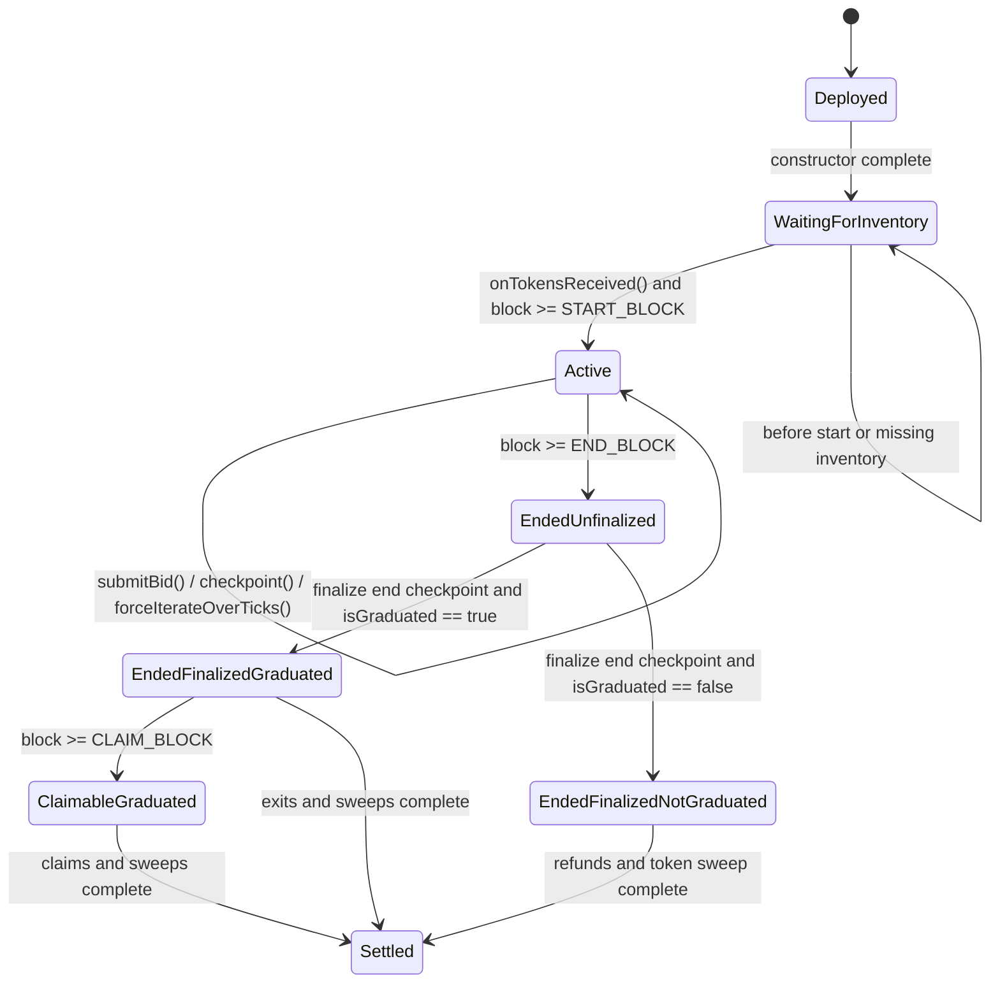

# Continuous Clearing Auction State Machine

This note describes the runtime state machine implemented by the Continuous Clearing Auction contract in `src/ContinuousClearingAuction.sol`.

## Scope

This state machine covers the auction contract itself.
It does not cover outer launchpad orchestration, token factory flows, or post-auction migration contracts beyond the auction's `lbpInitializationParams()` handoff.

## Core State Variables

These values determine the auction's state:

- `START_BLOCK` from `StepStorage`
- `END_BLOCK` from `StepStorage`
- `CLAIM_BLOCK` from `ContinuousClearingAuction`
- `$_tokensReceived` from `ContinuousClearingAuction`
- `$lastCheckpointedBlock` from `CheckpointStorage`
- `$clearingPrice` from `ContinuousClearingAuction`
- `$currencyRaisedQ96_X7` from `ContinuousClearingAuction`
- `REQUIRED_CURRENCY_RAISED_Q96_X7` from `TokenCurrencyStorage`
- `sweepCurrencyBlock` from `TokenCurrencyStorage`
- `sweepUnsoldTokensBlock` from `TokenCurrencyStorage`

## High-Level States

The contract behaves like a state machine with these effective states:

1. `Deployed`
2. `WaitingForInventory`
3. `Active`
4. `EndedUnfinalized`
5. `EndedFinalizedGraduated`
6. `EndedFinalizedNotGraduated`
7. `ClaimableGraduated`
8. `Settled`

Some of these overlap in storage terms, but they are distinct operational states because different public functions become valid or invalid.

## State Definitions

### 1. `Deployed`

Constructor has run, immutable parameters are locked, and the floor tick is initialized.

Entry actions:

- validate auction step data in `StepStorage`
- validate token, currency, recipients, floor price, and tick spacing
- set `CLAIM_BLOCK`
- compute `MAX_BID_PRICE`
- initialize `$clearingPrice = FLOOR_PRICE`
- emit `ClearingPriceUpdated`

Allowed observations:

- read-only getters

Not yet allowed:

- `submitBid()`
- `checkpoint()`

Transition conditions:

- if `_getBlockNumberish() < START_BLOCK`, the contract is effectively still pre-start
- if the full token inventory has not yet been confirmed, it remains inventory-blocked

### 2. `WaitingForInventory`

This is the pre-active state where the auction may be at or after `START_BLOCK`, but the full `TOTAL_SUPPLY` has not been confirmed in the contract.

Guard:

- `$_tokensReceived == false`

Relevant function:

- `onTokensReceived()`

Transition:

- `onTokensReceived()` checks `TOKEN.balanceOf(address(this)) >= TOTAL_SUPPLY`
- once true, sets `$_tokensReceived = true` and emits `TokensReceived`
- if current block is also at or after `START_BLOCK`, the auction can behave as `Active`

### 3. `Active`

This is the live bidding and price-discovery phase.

Guards:

- `_getBlockNumberish() >= START_BLOCK`
- `$_tokensReceived == true`
- bids additionally require `_getBlockNumberish() < END_BLOCK`

Allowed operations:

- `submitBid()`
- `checkpoint()`
- `forceIterateOverTicks()`

Core behavior:

- bids are inserted above the current clearing price only
- each bid updates tick demand and aggregate demand above clearing
- `checkpoint()` advances time-weighted token issuance and recomputes the clearing price
- clearing price never decreases

Internal actions during checkpoints:

- advance auction steps with `_advanceToStartOfCurrentStep()`
- iterate tick book with `_iterateOverTicksAndFindClearingPrice()`
- sell incremental supply with `_sellTokensAtClearingPrice()`
- insert a checkpoint with `_insertCheckpoint()`

Transitions out:

- when `_getBlockNumberish() >= END_BLOCK`, the live bidding phase ends

### 4. `EndedUnfinalized`

The auction has crossed `END_BLOCK`, but the end-block checkpoint may not yet exist.

Guards:

- `_getBlockNumberish() >= END_BLOCK`
- `$lastCheckpointedBlock != END_BLOCK`

Allowed operations:

- `exitBid()` will force finalization through `_getFinalCheckpoint()`
- `claimTokens()` and sweep functions use `ensureEndBlockIsCheckpointed`
- `lbpInitializationParams()` is not yet allowed

Transition:

- first path that requires final end-state accounting calls `_checkpointAtBlock(END_BLOCK)`
- once `$lastCheckpointedBlock == END_BLOCK`, the auction is finalized

### 5. `EndedFinalizedGraduated`

The end-block checkpoint exists and the auction reached its minimum raise threshold.

Guards:

- `$lastCheckpointedBlock == END_BLOCK`
- `_isGraduated() == true`

Allowed operations:

- `exitBid()` for bids strictly above final clearing price
- `exitPartiallyFilledBid()` for partially filled bids
- `lbpInitializationParams()`
- `sweepCurrency()`
- `sweepUnsoldTokens()`

Meaning:

- the auction outcome is successful
- bids settle into token allocations plus any refund
- raised funds can be swept to the configured funds recipient

### 6. `EndedFinalizedNotGraduated`

The end-block checkpoint exists, but required currency was not raised.

Guards:

- `$lastCheckpointedBlock == END_BLOCK`
- `_isGraduated() == false`

Allowed operations:

- `exitBid()` returns a full refund path
- `exitPartiallyFilledBid()` before end is forbidden; after end it also resolves to refund behavior if not graduated
- `sweepUnsoldTokens()` can recover all unsold inventory

Not allowed:

- `claimTokens()`
- `claimTokensBatch()`
- `sweepCurrency()`
- `lbpInitializationParams()` is structurally callable only when finalized, but callers must understand the auction did not graduate and the values are not a successful migration outcome

Meaning:

- the sale failed economically, even though final accounting exists

### 7. `ClaimableGraduated`

This is a substate of `EndedFinalizedGraduated` reached once token claiming is open.

Guards:

- `_getBlockNumberish() >= CLAIM_BLOCK`
- `$lastCheckpointedBlock == END_BLOCK`
- `_isGraduated() == true`

Allowed operations:

- `claimTokens()`
- `claimTokensBatch()`
- already-allowed sweep functions

Requirements per bid:

- bid must already have been exited
- `tokensFilled` must still be nonzero in storage

Claim action:

- `_internalClaimTokens()` reads `tokensFilled`
- zeroes out stored `tokensFilled`
- transfers tokens to the bid owner

### 8. `Settled`

This is not a single boolean state in storage, but the auction is effectively settled once post-auction assets have been resolved.

Indicators:

- all relevant bids have been exited
- claimable bids have been claimed or abandoned
- `sweepCurrencyBlock != 0` when graduated
- `sweepUnsoldTokensBlock != 0`

Meaning:

- operationally, nothing material remains except archival reads

## Transition Table

| From | Trigger | Guard | To | Notes |
|---|---|---|---|---|
| `Deployed` | constructor completes | always | `WaitingForInventory` or pre-start idle | Inventory and time gates are separate |
| `WaitingForInventory` | `onTokensReceived()` | full `TOTAL_SUPPLY` present | `Active` if block >= `START_BLOCK` | Otherwise pre-start but inventory-ready |
| pre-start inventory-ready | time passes | block >= `START_BLOCK` | `Active` | No explicit hook, just guard satisfaction |
| `Active` | time passes | block >= `END_BLOCK` | `EndedUnfinalized` | No more bidding |
| `EndedUnfinalized` | final checkpoint path | end block checkpoint inserted | `EndedFinalizedGraduated` or `EndedFinalizedNotGraduated` | Split by graduation threshold |
| `EndedFinalizedGraduated` | time passes | block >= `CLAIM_BLOCK` | `ClaimableGraduated` | Claim window opens |
| `ClaimableGraduated` | claims and sweeps finish | operational completion | `Settled` | Conceptual terminal state |
| `EndedFinalizedNotGraduated` | refunds and token sweep finish | operational completion | `Settled` | Conceptual terminal state |

## Function Availability by State

| Function | WaitingForInventory | Active | EndedUnfinalized | EndedFinalizedGraduated | EndedFinalizedNotGraduated | ClaimableGraduated |
|---|---|---|---|---|---|---|
| `onTokensReceived()` | yes | harmless no-op if already received | harmless | harmless | harmless | harmless |
| `submitBid()` | no | yes | no | no | no | no |
| `checkpoint()` | no | yes | returns final checkpoint path indirectly via callers | finalized already | finalized already | finalized already |
| `forceIterateOverTicks()` | no | yes | no | no | no | no |
| `exitBid()` | no | no | yes | yes | yes | yes |
| `exitPartiallyFilledBid()` | no | only in limited graduated partial-exit case | yes | yes | refund path after end | yes |
| `claimTokens()` | no | no | no | no before `CLAIM_BLOCK` | no | yes |
| `claimTokensBatch()` | no | no | no | no before `CLAIM_BLOCK` | no | yes |
| `sweepCurrency()` | no | no | yes after finalization path, if graduated | yes | no | yes |
| `sweepUnsoldTokens()` | no | no | yes after finalization path | yes | yes | yes |
| `lbpInitializationParams()` | no | no | no | yes | callable but not a successful graduation outcome | yes |

## Terminal Economic Outcomes

There are two economically terminal outcomes.

### Success Path

- auction finalizes
- graduation threshold is met
- bids exit into a combination of purchased tokens and refunds
- claims open at `CLAIM_BLOCK`
- raised currency can be swept
- unsold tokens can be swept
- `lbpInitializationParams()` becomes meaningful as migration input

### Failure Path

- auction finalizes
- graduation threshold is not met
- bids exit via refund behavior
- claims are disabled because no successful sale is recognized
- currency cannot be swept as raised proceeds
- unsold tokens can be swept back out

## Mermaid Diagram

## Practical Reading Guide

If you are tracing the code, read it in this order:

1. `src/ContinuousClearingAuction.sol`
2. `src/StepStorage.sol`
3. `src/TickStorage.sol`
4. `src/CheckpointStorage.sol`
5. `src/libraries/CheckpointAccountingLib.sol`
6. `src/TokenCurrencyStorage.sol`

That order matches the state-machine flow: schedule, demand book, checkpointing, settlement, then asset distribution.