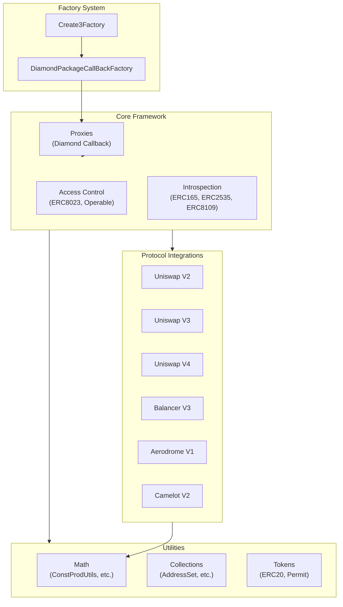
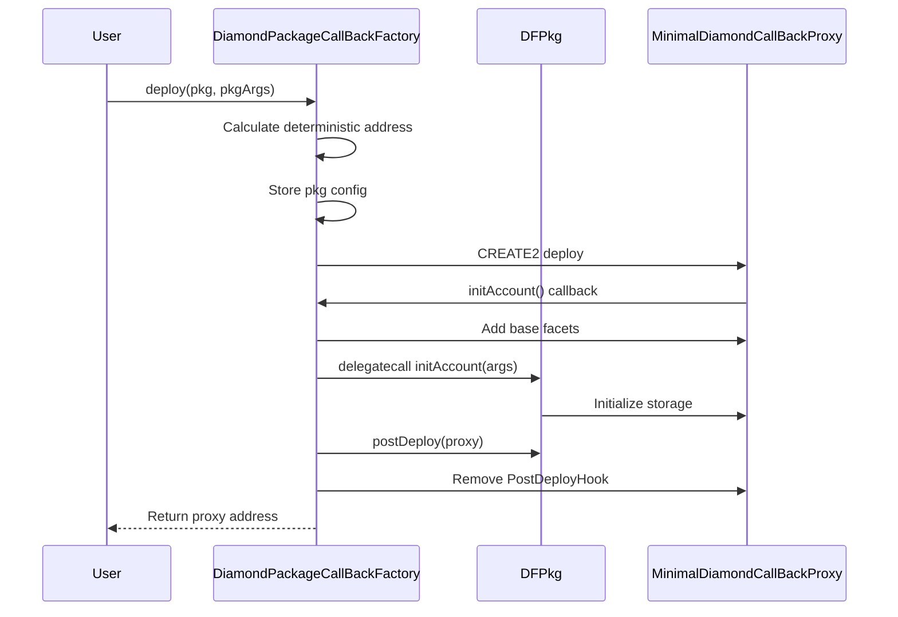
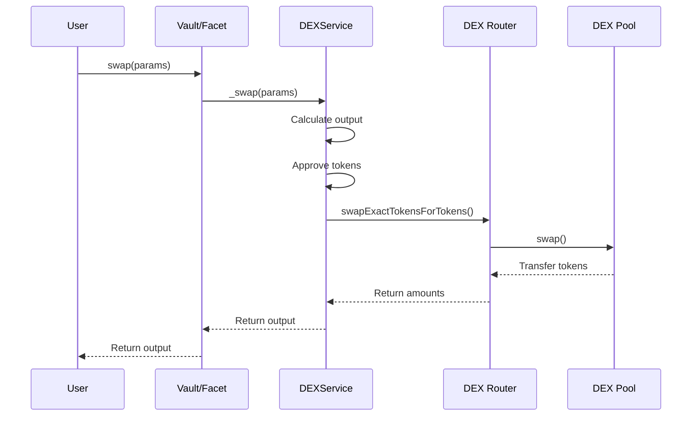

# Crane Framework - Codebase Map

> Auto-generated by Cartographer. Last mapped: 2026-01-13

Crane is a Diamond-first (ERC2535) Solidity development framework for building modular, upgradeable smart contracts. It provides structured patterns, deterministic deployment infrastructure, and protocol integration utilities for DeFi development.

## System Overview



## Directory Structure

```
contracts/
├── access/                     # Access control patterns
│   ├── ERC8023/                # Multi-step ownership (12 files, ~12k tokens)
│   ├── operable/               # Operator-based permissions
│   └── reentrancy/             # Reentrancy guards (EIP-1153)
├── constants/                  # Network/deployment constants
│   └── networks/               # Chain-specific configs
├── factories/                  # Deployment infrastructure
│   ├── create3/                # CREATE3 deterministic deployment
│   └── diamondPkg/             # Diamond package factory
├── interfaces/                 # Contract interfaces (~38k tokens)
│   ├── proxies/                # Proxy interfaces
│   └── ...                     # Protocol-specific interfaces
├── introspection/              # Diamond introspection
│   ├── ERC165/                 # Interface detection
│   ├── ERC2535/                # Diamond storage/management
│   └── ERC8109/                # Enhanced Diamond introspection
├── protocols/dexes/            # DEX integrations (~328k tokens)
│   ├── aerodrome/v1/           # Aerodrome V1 (70 files)
│   ├── balancer/v3/            # Balancer V3 (35 files)
│   ├── camelot/v2/             # Camelot V2 (13 files)
│   └── uniswap/                # Uniswap V2/V3/V4 (73 files)
├── protocols/tokens/           # Token protocol integrations
│   └── wrappers/weth/          # WETH9 integration
├── protocols/utils/            # Protocol utilities
│   └── permit2/                # Uniswap Permit2
├── proxies/                    # Proxy implementations
├── registries/                 # Registry contracts
├── test/                       # Test infrastructure
│   ├── behaviors/              # Reusable test logic
│   ├── comparators/            # Assertion helpers
│   └── stubs/                  # Mock implementations
├── tokens/                     # Token implementations (~38k tokens)
│   ├── ERC20/                  # ERC20 with Diamond storage
│   ├── ERC2612/                # ERC20 Permit
│   └── ERC4626/                # Tokenized vaults
└── utils/                      # Utilities (~98k tokens)
    ├── collections/            # Sets, arrays
    ├── cryptography/           # EIP-712
    └── math/                   # AMM math, conversions

test/foundry/
├── spec/                       # Unit/integration tests
│   ├── access/                 # Access control tests
│   ├── factories/              # Factory tests
│   ├── introspection/          # Diamond tests
│   ├── protocols/dexes/        # DEX tests
│   ├── tokens/                 # Token tests
│   └── utils/                  # Utility tests
└── fork/                       # Mainnet fork tests
    └── ethereum_main/          # Ethereum mainnet forks
```

## Module Guide

### Access Control (`contracts/access/`)

**Purpose**: Secure access patterns for Diamond proxies

| Module | Purpose | Key Files |
|--------|---------|-----------|
| **ERC8023** | Multi-step ownership transfer | `MultiStepOwnableRepo.sol`, `MultiStepOwnableFacet.sol` |
| **Operable** | Granular operator permissions | `OperableRepo.sol`, `OperableFacet.sol` |
| **Reentrancy** | Reentrancy guards (EIP-1153) | `ReentrancyLockRepo.sol`, `ReentrancyLockModifiers.sol` |

**Patterns**:
- **Facet-Target-Repo**: All access control uses this pattern
- **Guard functions**: `_onlyOwner()`, `_onlyOperator()` in Repos
- **Modifiers**: Thin wrappers delegating to guard functions

**Gotchas**:
- ERC8023 requires buffer period + confirmation before transfer completes
- Operators can be global or per-function (`isOperatorFor` mapping)
- Reentrancy uses transient storage (auto-clears at transaction end)

---

### Factory System (`contracts/factories/`)

**Purpose**: Deterministic cross-chain deployment via CREATE3

| Component | Purpose |
|-----------|---------|
| `Create3Factory` | Deploy any contract with deterministic addresses |
| `DiamondPackageCallBackFactory` | Deploy Diamond proxies via callback pattern |
| `IDiamondFactoryPackage` | Interface for deployment packages |

**Deployment Flow**:
```
1. User calls factory.deploy(pkg, pkgArgs)
2. Factory calculates deterministic address via CREATE2
3. Factory deploys MinimalDiamondCallBackProxy
4. Proxy constructor calls factory.initAccount()
5. Factory delegatecalls pkg.initAccount() to initialize storage
6. Factory calls pkg.postDeploy() for cleanup
```

**Key Invariants**:
- Same salt + same deployer = same address across all chains
- Never use `new` for deployment (breaks determinism)
- Facets are deployed once, reused by all proxies

---

### Introspection (`contracts/introspection/`)

**Purpose**: Diamond proxy storage and inspection

| Module | Purpose | Storage Slot |
|--------|---------|--------------|
| **ERC165** | Interface detection | `keccak256("eip.erc.165")` |
| **ERC2535** | Diamond storage/cuts | `keccak256("eip.erc.2535")` |
| **ERC8109** | Enhanced introspection | Shares with ERC2535 |

**Diamond Storage** (`ERC2535Repo`):
```solidity
struct Storage {
    AddressSet facetAddresses;
    mapping(bytes4 => address) facetAddress;
    mapping(address => Bytes4Set) facetFunctionSelectors;
}
```

**FacetCut Operations**:
- **Add**: Map new selectors to facet
- **Replace**: Remap existing selectors to new facet
- **Remove**: Unmap selectors from facet

---

### DEX Integrations (`contracts/protocols/dexes/`)

#### Uniswap V2

**Purpose**: Constant product AMM operations

| Component | Purpose |
|-----------|---------|
| `UniswapV2Service` | Swap, deposit, withdraw operations |
| `UniswapV2FactoryAwareRepo` | Factory storage |
| `UniswapV2RouterAwareRepo` | Router storage |

**Key Functions**:
- `_swap()`: Execute token swap via router
- `_deposit()`: Add liquidity to pool
- `_swapDeposit()`: Zap-in (single token to LP)
- `_withdrawSwapDirect()`: Zap-out (LP to single token)

**Gotchas**:
- Hardcoded 300 bps fee (0.3%)
- Uses `ConstProdUtils` for AMM math
- No slippage protection in helpers (calling code must validate)

#### Uniswap V3

**Purpose**: Concentrated liquidity operations

| Component | Purpose |
|-----------|---------|
| `TestBase_UniswapV3` | Full V3 test infrastructure |
| `TickMath`, `SqrtPriceMath` | V3 math libraries |
| Callback implementations | Mint/swap callbacks |

**Key Concepts**:
- Prices as Q64.96 sqrt values
- Fee tiers: 500 (0.05%), 3000 (0.3%), 10000 (1%)
- Tick spacing tied to fee tier

#### Uniswap V4

**Purpose**: Singleton PoolManager with hooks

| Component | Purpose |
|-----------|---------|
| `UniswapV4Utils` | Single-tick quoting |
| `UniswapV4Quoter` | Multi-tick quoting |
| `PoolKey`, `PoolId` | Pool identification |

**Key Differences from V3**:
- Singleton architecture (one PoolManager)
- Hooks enable custom pool behavior
- Native ETH support via Currency type

**Gotchas**:
- `UniswapV4Utils` does NOT handle tick crossing
- Use `UniswapV4Quoter` for multi-tick swaps

#### Balancer V3

**Purpose**: Vault-centric pool operations

| Component | Purpose |
|-----------|---------|
| `BalancerV3VaultAwareRepo` | Vault storage |
| `BalancerV3PoolRepo` | Pool configuration |
| `BalancerV3ConstantProductPoolTarget` | x*y=k AMM |
| `ERC4626RateProviderTarget` | Yield token pricing |

**Architecture**:
- Vault is singleton managing all pools
- Pool tokens (BPT) stored in Vault
- Rate providers adjust balances for yield tokens

#### Aerodrome V1

**Purpose**: AMM on Base with stable/volatile pools

| Component | Purpose |
|-----------|---------|
| `AerodromService` | Swap/liquidity operations |
| `AerodromeRouterAwareRepo` | Router storage |
| `AerodromePoolMetadataRepo` | Pool type (stable/volatile) |

**Key Differences**:
- Fee denominator: 10000 (not 100000)
- Supports stable curve pools
- Multi-factory routing via Route struct

#### Camelot V2

**Purpose**: DEX on Arbitrum with dynamic fees

| Component | Purpose |
|-----------|---------|
| `CamelotV2Service` | Swap/liquidity operations |
| `CamelotV2RouterAwareRepo` | Router storage |

**Key Differences**:
- Per-token fees (each token in pair has different fee)
- Referrer system (fee sharing)
- Uses `SupportingFeeOnTransferTokens` swap variants

---

### Utilities (`contracts/utils/`)

#### Math Libraries

| Library | Purpose |
|---------|---------|
| `ConstProdUtils` | Constant product AMM math (x*y=k) |
| `BetterMath` | Extended OpenZeppelin Math |
| `UniswapV2Utils` | V2-specific withdraw/swap quotes |
| `CamelotV2Utils` | Camelot-specific calculations |
| `AerodromeUtils` | Aerodrome-specific calculations |

**ConstProdUtils Key Functions**:
- `_saleQuote()`: Output for given input (exact in)
- `_purchaseQuote()`: Input for given output (exact out)
- `_swapDepositSaleAmt()`: Optimal zap-in swap amount
- `_depositQuote()`: LP tokens from deposit
- `_withdrawQuote()`: Tokens from LP burn

**Protocol-Specific Differences**:

| Protocol | Fee Denominator | Protocol Fee |
|----------|-----------------|--------------|
| Uniswap V2 | 1000 | 1/6 of LP fees |
| Camelot V2 | 100000 | Variable |
| Aerodrome | 10000 | Extracted to PoolFees |

#### Collections

| Library | Purpose |
|---------|---------|
| `AddressSetRepo` | Gas-efficient address set |
| `Bytes4SetRepo` | Selector set |
| `UInt256SetRepo` | Uint256 set |

**Pattern**: 1-indexed mapping with swap-and-pop removal

#### Cryptography

| Library | Purpose |
|---------|---------|
| `EIP712Repo` | EIP-712 domain separator |
| `BetterEfficientHashLib` | Gas-optimized hashing |

---

### Token Implementations (`contracts/tokens/`)

| Module | Purpose |
|--------|---------|
| `ERC20Repo` | Diamond storage for ERC20 |
| `ERC20Target` | ERC20 interface implementation |
| `ERC2612Repo` | Permit nonces |
| `ERC4626` | Tokenized vault shares |

**Pattern**: All tokens use Facet-Target-Repo with Diamond storage

---

### Test Infrastructure (`contracts/test/`)

| Component | Purpose |
|-----------|---------|
| `CraneTest` | Base test with factory setup |
| `TestBase_IFacet` | Facet metadata validation |
| `Behavior_*` | Reusable test logic |
| `*Comparator` | Deep comparison with logging |

**Test Hierarchy**:
```
CraneTest                    # Factory setup
  └── TestBase_*             # Protocol setup
      └── YourTest.t.sol     # Actual tests
```

---

## Data Flow

### Diamond Deployment



### DEX Swap Flow



---

## Conventions

### Naming

| Pattern | Usage | Example |
|---------|-------|---------|
| `*Repo.sol` | Storage library | `ERC20Repo.sol` |
| `*Target.sol` | Implementation | `ERC20Target.sol` |
| `*Facet.sol` | Diamond facet | `ERC20Facet.sol` |
| `*Service.sol` | Stateless library | `CamelotV2Service.sol` |
| `*AwareRepo.sol` | Dependency injection | `WETHAwareRepo.sol` |
| `TestBase_*.sol` | Test base class | `TestBase_UniswapV2.sol` |
| `Behavior_*.sol` | Test behavior lib | `Behavior_IFacet.sol` |

### Storage Slots

All Repos use deterministic slots:
```solidity
bytes32 internal constant STORAGE_SLOT = keccak256(abi.encode("namespace.path"));
```

Common namespaces:
- `eip.erc.*` - ERC standards
- `crane.*` - Crane-specific
- `protocols.dexes.*` - DEX integrations

### Code Style

Section headers:
```solidity
/* -------------------------------------------------------------------------- */
/*                             Section Name                                   */
/* -------------------------------------------------------------------------- */
```

---

## Gotchas

### Critical

1. **Never use `new` for deployment** - Use CREATE3 factory for determinism
2. **Never enable `viaIR`** - Use struct refactoring for stack-too-deep
3. **Fee denominators vary by protocol** - Uniswap: 1000, Camelot: 100000, Aerodrome: 10000
4. **UniswapV4Utils doesn't cross ticks** - Use UniswapV4Quoter for multi-tick

### Common

1. **First LP deposit burns 1000 wei** - `MINIMUM_LIQUIDITY` lock
2. **ERC8023 requires buffer period** - Can't instant-transfer ownership
3. **Camelot has per-token fees** - Not per-pair like V2
4. **Balancer BPT is Vault-managed** - All ERC20 ops delegate to Vault
5. **ERC165 indexes are 1-based** - 0 means not present in sets
6. **Rate providers use previewRedeem** - Not convertToAssets

---

## Navigation Guide

### To add a new facet:
1. Create `*Repo.sol` with Diamond storage
2. Create `*Target.sol` implementing interface
3. Create `*Facet.sol` extending Target + IFacet
4. Add `*Facet_IFacet.t.sol` test
5. Deploy via Create3Factory

### To add a new DEX integration:
1. Create `*AwareRepo.sol` for router/factory storage
2. Create `*Service.sol` for swap/liquidity operations
3. Create `TestBase_*.sol` with protocol setup
4. Add service tests mirroring existing patterns

### To add protocol fee support:
1. Check ConstProdUtils for existing protocol math
2. Create `*Utils.sol` if protocol-specific sqrt/fee needed
3. Use correct fee denominator for protocol
4. Test with `_quoteWithdrawSwapWithFee()` pattern

### To write tests:
1. Inherit from appropriate TestBase
2. For facets: use TestBase_IFacet for metadata validation
3. For DEX: use TestBase_*_Pools for pre-configured pools
4. For fork: use TestBase_*Fork with mainnet RPC

---

## Key Files Reference

| Purpose | File |
|---------|------|
| Factory initialization | `contracts/InitDevService.sol` |
| CREATE3 deployment | `contracts/factories/create3/Create3Factory.sol` |
| Diamond storage | `contracts/introspection/ERC2535/ERC2535Repo.sol` |
| Diamond factory | `contracts/factories/diamondPkg/DiamondPackageCallBackFactory.sol` |
| AMM math | `contracts/utils/math/ConstProdUtils.sol` |
| ERC20 storage | `contracts/tokens/ERC20/ERC20Repo.sol` |
| Multi-step ownership | `contracts/access/ERC8023/MultiStepOwnableRepo.sol` |
| Operator access | `contracts/access/operable/OperableRepo.sol` |
| Test base | `contracts/test/CraneTest.sol` |
| Facet testing | `contracts/factories/diamondPkg/TestBase_IFacet.sol` |
| Style guide | `contracts/StyleGuide.sol` |
