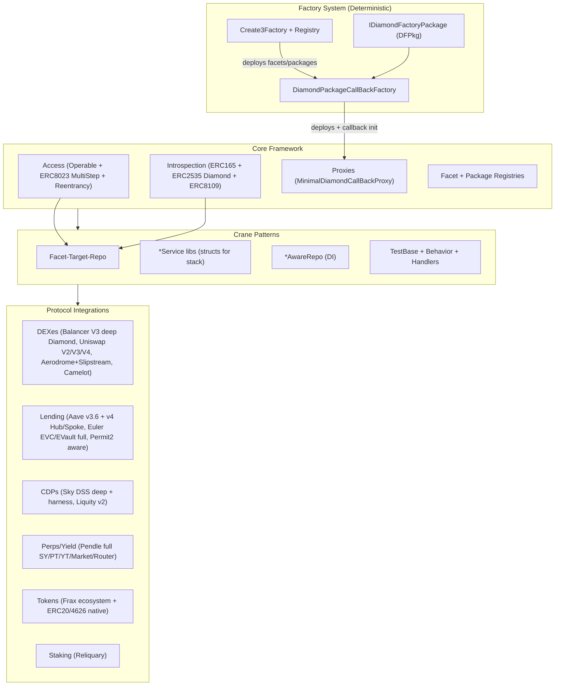

# Crane Framework - Codebase Map

> Auto-generated by Cartographer. Last mapped: 2026-06-29T01:28:29Z

**Scope note**: Full tree includes massive vendored dependencies (`contracts/external/`, `lib/`) and generated artifacts. Focused Crane source (non-external contracts + test specs + key docs/scripts/skills) ≈ 4,631 files / ~6.9M tokens. Core framework + integration surfaces are substantially smaller; protocol mass comes from faithful ports (Pendle, Frax, Aave full trees, etc.).

## System Overview

Crane is a **Diamond-first (ERC2535)** Solidity development framework for modular, upgradeable smart contracts. It emphasizes deterministic CREATE3 + callback-based Diamond deployments, a strict Facet-Target-Repo + Service + DFPkg pattern, rich testing (TestBase/Behavior/handler + invariants), and first-class ports of major DeFi protocols with shared dependencies remapped to Crane equivalents.


```mermaid
graph TB
    subgraph Factories["Factory System (Deterministic)"]
        Create3["Create3Factory + Registry"]
        DiamondFactory["DiamondPackageCallBackFactory"]
        DFPkg["IDiamondFactoryPackage (DFPkg)"]
    end

    subgraph Core["Core Framework"]
        Access["Access (Operable + ERC8023 MultiStep + Reentrancy)"]
        Introspection["Introspection (ERC165 + ERC2535 Diamond + ERC8109)"]
        Proxy["Proxies (MinimalDiamondCallBackProxy)"]
        Registries["Facet + Package Registries"]
    end

    subgraph Patterns["Crane Patterns"]
        FTR["Facet-Target-Repo"]
        Service["*Service libs (structs for stack)"]
        Aware["*AwareRepo (DI)"]
        Test["TestBase + Behavior + Handlers"]
    end

    subgraph Protocols["Protocol Integrations"]
        DEX["DEXes (Balancer V3 deep Diamond, Uniswap V2/V3/V4, Aerodrome+Slipstream, Camelot)"]
        Lend["Lending (Aave v3.6 + v4 Hub/Spoke, Euler EVC/EVault full, Permit2 aware)"]
        CDP["CDPs (Sky DSS deep + harness, Liquity v2)"]
        Perp["Perps/Yield (Pendle full SY/PT/YT/Market/Router)"]
        Token["Tokens (Frax ecosystem + ERC20/4626 native)"]
        Stake["Staking (Reliquary)"]
    end

    Create3 -->|deploys facets/packages| DiamondFactory
    DiamondFactory -->|deploys + callback init| Proxy
    DFPkg --> DiamondFactory
    Core --> Patterns
    Patterns --> Protocols
    Access & Introspection --> FTR
```

Core bootstrap: `InitDevService` / `InitBcService` (BattleChain-aware).

## Directory Structure (Focused)

```
contracts/
├── access/                  # Operable, ERC8023 (MultiStepOwnable), reentrancy (transient)
├── constants/               # Shared + per-network constants
├── factories/
│   ├── create3/             # Create3Factory, bootstrap, DFPkg, aware/service
│   └── diamondPkg/          # DiamondPackageCallBackFactory, IFacet, Behavior/TestBase_IFacet, IDiamondFactoryPackage
├── interfaces/              # Core (IFacet, IDiamond*, ICreate3*, IPermit2Aware...) + protocol
├── introspection/           # ERC165, ERC2535 (Diamond repo/cut/loupe), ERC8109
├── protocols/
│   ├── cdps/                # Sky (deep DSS + SkyDssFactoryService + TestBase), Liquity v2
│   ├── dexes/               # balancer/v3 (deepest: diamond vault/router/pools, DFPkgs), uniswap/v2/v3/v4, aerodrome/{v1,slipstream}, camelot/v2
│   ├── lending/             # aave/{v3.6, v4 hub/spoke + tokenization + config-engine}, euler/v1 (EVC + EVault + periphery)
│   ├── oracles/             # Chainlink interfaces
│   ├── perps/pendle/        # Full vendored (SY, Market, PT/YT, RouterV4, LM, oracles, offchain)
│   ├── staking/reliquary/   # Reliquary + curves + RollingRewarder + Service + TestBase
│   ├── tokens/              # stable/frax (large ecosystem), wrappers/weth
│   ├── utils/permit2/       # Full port + Crane-native Permit2Aware (Repo/Target/Facet)
│   └── wallets/gnosis/      # GPv2SafeERC20
├── proxies/                 # MinimalDiamondCallBackProxy + resolution
├── registries/              # Facet + DiamondFactoryPackage registries (with services/facets)
├── test/                    # Crane test infra (CraneTest, behaviors, comparators, stubs, bases)
├── tokens/                  # Native ERC20 / ERC2612 / ERC4626 (full FTR + DFPkg + Service)
├── utils/                   # Collections (SetRepos), math (ConstProdUtils + protocol), cryptography, Better* libs, Creation, SafeERC20, TransientSlot
└── StyleGuide.sol, InitDevService.sol, InitBcService.sol, GeneralErrors.sol

contracts/external/          # Faithful vendored upstream (Balancer, Aave deps, OpenZeppelin, Solady partial, Uniswap, Pyth, Redstone, Frax-std, etc.). Remapped imports to @crane/.

test/foundry/
├── spec/                    # Specs mirroring contracts/ (unit, integration, invariants, handlers)
└── fork/                    # Fork tests (mainnet parity for DEXes/lending)

scripts/foundry/             # Pilot scripts (e.g. Script_Pilot_BC_ERC20Permit)

.claude/skills/              # 100+ agent skills (crane-*, forge-*, protocol deep dives for aave/balancer/aerodrome/uniswap/pendle/etc + wagmi/tevm/voltaire)

docs/                        # Architecture, deployment, development, protocol notes, PRDs
```

## Module Guide

### Core Framework & Patterns

**StyleGuide + Init services**
- `contracts/StyleGuide.sol`: Mandatory conventions (headers, import groups, naming `_layoutStruct`/`_onlyXxx`/`param_`, NatSpec + AsciiDoc tags, storage slot hierarchy).
- `InitDevService` / `InitBcService`: Single source of truth for bootstrapping Create3Factory + DiamondPackageCallBackFactory + canonical facets in tests/scripts (BattleChain variant for traceable top-level).

**Access Control**
- `operable/`: OperableRepo (guards + global/per-function operators), Target, Facet, Modifiers. Guards callable from other Repos.
- `ERC8023/`: MultiStepOwnable (initiate/confirm flow) with buffer + view facet. Full FTR + TestBase.
- `reentrancy/`: Transient (EIP-1153) lock.

**Factories & Deployment**
- Two-factory system: Create3Factory (facets, packages, any contract) + DiamondPackageCallBackFactory (proxies with delegatecall `initAccount`).
- `IDiamondFactoryPackage` (DFPkg): `PkgInit` (immutables), `facetCuts`, `diamondConfig`, `calcSalt`, `initAccount`, `postDeploy`.
- FactoryService libs for grouped deterministic deploys (name-hash salts + `vm.label`).
- `MinimalDiamondCallBackProxy` + resolution via ERC2535 loupe.

**Introspection (Diamond)**
- ERC165Repo + Facet.
- ERC2535Repo (AddressSet + per-facet selectors; diamondCut logic with validation).
- DiamondLoupeFacet + DiamondCutFacet.
- ERC8109 extension.
- Full Behavior/TestBase support + comparators.

**Registries**

**Dedicated Registries Documentation (LR-2 GitBook requirement)**: The registries (FacetRegistry, DiamondFactoryPackageRegistry/PackageRegistry, CallTargetRegistry) are foundational to Crane's deterministic, reusable deployment model. They provide on-chain discovery, canonical resolution, and dynamic configuration. This enables agents and developers to "deploy once, attach everywhere" (LR-4). 

To set up a chain presence (per LR-2): Use the CREATE3 Package (Create3FactoryDFPkg) to deploy your own Create3Factory on a new chain. The Diamond Package Factory (DiamondPackageCallBackFactory, interface ID from central values: `0x949da331`) does **not** need to be redeployed per chain — it is safe and intended for public reuse across all deployments (attach via `setDiamondPackageFactory` or reuse in calc/deploy flows). See cross-links below and `docs/deployment/create3.md`, `docs/deployment/dfpkg.md` (required GitBook areas).

The registries provide on-chain discovery, canonical resolution, and configuration for facets, packages, and call targets. They are core to Crane's reuse model (see LR-4 in PRD.md): deploy facets/packages once via CREATE3, register them, then discover and reuse via queries or canonical lookups instead of hardcoding addresses or redeploying bytecode. This reduces gas and eliminates per-project reimplementation risk. Security benefit (verbatim LR-4): "The primary security advantage is the ability to reuse already deployed and verified code. ... Reusing battle-tested, already-audited deployed logic removes that class of error." Cost benefit: "directly saves gas by simply not needing to deploy as much bytecode."

There are three primary registries (all using Facet-Target-Repo or direct + protected by Operable/ownership; integrated with Create3Factory and bootstrap; facets implement `IFacet` using ONLY central NatSpec values: `facetName()` 0x5b6f4d01, `facetInterfaces()` 0x2ea80826, `facetFuncs()` 0x574a4cff, `facetMetadata()` 0xf10d7a75):

- **FacetRegistry** (`contracts/registries/facet/`): Tracks deployed `IFacet` implementations. Full FTR (IFacetRegistry + FacetRegistryTarget + FacetRegistryFacet + FacetRegistryRepo + FacetRegistryService + Behavior/Handler for testing).
  - **Purpose**: Enables lookup of facets by name, supported interface(s), or function selector(s). Provides `canonicalFacet(bytes4 interfaceId)` to resolve the preferred implementation for a given interface (used heavily during DFPkg construction and Init*Service bootstrap to avoid address literals). Supports `registerFacet` and `setCanonicalFacet` for manual/override registration. Enables agent-proof reuse of verified facets.
  - **Population**: Auto-populated on successful `deployFacet*` calls through `Create3Factory` (or the registry's own deploy wrappers) — after CREATE3 deployment, the code calls `facet.facetMetadata()` (which returns name + `facetInterfaces()` + `facetFuncs()`) and stores via `FacetRegistryRepo._registerFacet`. Manual registration also available via `registerFacet(IFacet, string, bytes4[], bytes4[])`. See Create3Factory._registerFacet (uses `facet.facetMetadata()`), FacetRegistryService. Post-deploy, `Behavior_IFacetRegistry` + tests assert population (LR-7).
  - **Usage/Consumer Interaction**:
    - Query: `allFacets()`, `facetsOfName(name)`, `facetsOfInterface(interfaceId)`, `facetsOfFunction(selector)`, `nameOfFacet(facet)`, `interfacesOfFacet(facet)`, `functionsOfFacet(facet)`.
    - Canonical resolution: `canonicalFacet(someInterfaceId)` — e.g. during package init to pull `diamondCutFacet`, `operableFacet`, etc. Example from InitDevService: `IFacetRegistry(address(factory)).canonicalFacet(type(IDiamondCut).interfaceId)`.
    - In practice (from InitDevService): `IFacetRegistry(address(factory)).canonicalFacet(type(IFacetRegistry).interfaceId)` and similar for `type(IOperable).interfaceId`, `type(IDiamondCut).interfaceId`, etc. Also used for registry facets themselves.
    - The registry facet itself implements `IFacet` (central values: `facetName()` selector `0x5b6f4d01`, `facetInterfaces()` `0x2ea80826`, `facetFuncs()` `0x574a4cff`, `facetMetadata()` `0xf10d7a75`).
    - In tests/agents: Use `Behavior_IFacetRegistry` (expect/isValid paths) + assert post-deploy registry entries.
    - Cross-link: `docs/deployment/dfpkg.md`, `docs/deployment/create3.md` (GitBook areas), `AGENTS.md` (FactoryService + bootstrap + key files), `contracts/registries/facet/FacetRegistryRepo.sol` (uses `DEFAULT_SLOT = bytes32(uint256(keccak256(abi.encode("crane.registries.facets"))) - 1)` per LR-6), `contracts/interfaces/IFacetRegistry.sol`.

- **DiamondFactoryPackageRegistry** (aka Package Registry, `contracts/registries/package/`): Tracks `IDiamondFactoryPackage` (DFPkg) deployments. (IFacet + IDiamondFactoryPackageRegistry + ... + DiamondFactoryPackageRegistryRepo + Behavior_IDiamondFactoryPackageRegistry).
  - **Purpose**: Similar discovery for packages by name, implemented interfaces, or contained facets. Provides canonical resolution per interface for packages. Enables consumers to find packaged facet bundles for deterministic proxy deployment via `DiamondPackageCallBackFactory`. Core to reuse of DFPkgs (e.g. ERC20DFPkg, Create3FactoryDFPkg, CallTargetRegistryDFPkg, BountyBoardDFPkg).
  - **Population**: Auto on `deployPackage*` via Create3Factory (calls `package.packageMetadata()` returning name/interfaces/facets, then `DiamondFactoryPackageRegistryRepo._registerPackage`). Also supports `registerPackage` + `setCanonicalPackage`. See Create3Factory._registerPackage + central DFPkg values: `packageName()` `0xabc8b346`, `facetInterfaces()` `0x2ea80826`, `initAccount(bytes)` `0x870d4838`, `postDeploy(address)` `0x70068fcf`, `facetCuts()` etc.
  - **Usage**: `allPackages()`, `packagesByName`, `packagesByInterface`, `packagesByFacet(facet)`, `canonicalPackage(interfaceId)`, `nameOfPackage`. Used in bootstrap flows (see InitDevService deploying Create3DFPkg/CallTargetDFPkg/BountyBoardDFPkg via `deployCanonicalPackageWithArgs` + `type(ICREATE3DFPkg).interfaceId`) and by agents to reuse shared DFPkgs without redeploying facets. Explicit note per LR-2: The `DiamondPackageCallBackFactory` (interface ID from central: `0x949da331`) does **not** need redeployment per chain — it is safe and intended for public reuse across deployments (see `DiamondPackageCallBackFactory` + `IDiamondPackageCallBackFactory`; e.g. `factory.setDiamondPackageFactory(diamondFactory)` once per Create3Factory instance).
  - Cross-link: `IDiamondFactoryPackage` (central values listed above + `facetCuts()` `0xa4b3ad35`, `diamondConfig()` `0x65d375b3`, `calcSalt(bytes)` `0xd82be56e`), `docs/deployment/dfpkg.md`, `docs/deployment/create3.md`, `AGENTS.md`, `Behavior_IDiamondFactoryPackageRegistry`.

- **CallTargetRegistry** (`contracts/registries/target/`, split into Management + Query facets + DFPkg `CallTargetRegistryDFPkg`):
  - **Purpose**: Acts as a dynamic configuration oracle for call targets. Allows setting default (or per-caller) target addresses for a given interface ID. Consumers query to resolve "who should I call for this interface" without embedding addresses or redeploying when targets change. Useful for proxies, routers, or multi-target systems. Complements other registries for full DI in protocols.
  - **Population**: Explicitly via `setDefaultCallTargetForID` / `setCallTargetForIDForCaller` (governed by management facet, typically owner/operator). Not auto-populated on deploy. Part of bootstrap via `CallTargetRegistryDFPkg` (see InitDevService using canonical facets).
  - **Usage/Interaction**: `defaultCallTargetForID(interfaceId)`, `callTargetForIDForCaller(interfaceId, caller)`. Interfaces split: `ICallTargetRegistryQuery` + `ICallTargetRegistryManagement`. Deployed/queried in core flows and tests (Behavior_ICallTargetRegistry*).
  - Note: Current Repo uses direct keccak slot (see LR-6 migration notes in PRD); query/management separated for access control. Uses central IFacet selectors on its facets.

All registries are deployed as facets (via `Create3FactoryBootstrap` using salts from type names, e.g. `FACET_REGISTRY_FACET_SALT = keccak256(abi.encode(type(FacetRegistryFacet).name))`) and attached to the canonical Create3Factory instance (which itself exposes registry facets). After any factory/package-based deployment, tests must verify that FacetRegistry, PackageRegistry, CallTargetRegistry contain the expected entries (per LR-7). See `contracts/interfaces/IFacetRegistry.sol`, `IDiamondFactoryPackageRegistry.sol`, `ICallTargetRegistry*`, `InitDevService.sol`, `Create3Factory.sol`, and `Behavior_*` (e.g. for registries) for details. Agent usage: Consult `crane-deployment` skill + AGENTS.md for bootstrapping + registry queries in DFPkg flows. Cross-links to GitBook required areas: deployment docs, protocol TestBases (which assert registry state), AGENTS.md.

**General Utilities (and Type Libraries) — Detailed Coverage (LR-2)**

Crane's `contracts/utils/` provides low-level building blocks used throughout Repos, Services, tests, and protocol ports. These are **not** simple wrappers in many cases — they are optimized for Diamond storage patterns, gas, and the set/AMM/permitting needs of DeFi. Detailed coverage supports agent consumption of reusable math/collections (ties to LR-4 reuse: reuse `ConstProdUtils` + Sets instead of reimplementing in every port or protocol integration).

- **Collections & Sets** (`utils/collections/sets/` and `BetterArrays.sol`):
  - Type-specific set implementations (all follow same 1-indexed struct + Repo pattern for storage-direct ops):
    - `AddressSet` / `AddressSetRepo`: struct { mapping(address=>uint256) indexes; address[] values; } (0 = absent). `_add`/`_remove` (idempotent), `_contains`, `_length`, `_index`, `_indexOf`, `_values` (returns storage pointer), `_asArray`, `_range`, `_addAsc`/`_removeAsc` (binary search + shift for sorted determinism), `_sortAsc`.
    - `Bytes32Set` / `Bytes32SetRepo`, `Bytes4Set` / `Bytes4SetRepo` (heavily used for selector sets in ERC2535Repo + comparators), `StringSet` / `StringSetRepo`, `UInt256Set` / `UInt256SetRepo`.
  - **Repo pattern**: Library with dual overloads where applicable; operates directly on `Storage` structs (no copying like OZ EnumerableSet). Supports multi-value add/remove loops. Asc variants preserve order for deterministic enumeration (key for registries, facets).
  - Usage examples: `FacetRegistryRepo` stores `AddressSet` per name/interface/func + allFacets (see `_registerFacet`); `ERC2535Repo` uses `AddressSet facetAddresses` + per-facet `Bytes4Set` for selectors; `OperableRepo` for function operators; `DiamondFactoryPackageRegistryRepo` for packages; handlers/comparators (e.g. `Bytes4SetComparatorRepo`); tests track expected sets.
  - Why custom: Storage pointer returns for gas (e.g. `_values`), direct storage mutation, asc ordering, multi-ops. 
  - Cross-links: Used in almost every Repo (see `ERC2535Repo`, `FacetRegistryRepo`, `OperableRepo`, registry repos), test comparators (`Bytes4SetComparator`), handlers. Documented in AGENTS.md (architecture + testing), `StyleGuide.sol`, protocol services. See `crane-architecture` skill. LR-2 GitBook tie: general type libraries section + test usage via CraneTest handlers.

- **Math Utilities** (`utils/math/` + root math libs):
  - `ConstProdUtils`: Core constant-product AMM math (shared across all DEX ports for quotes/swaps without duplication). Key functions (see source for full):
    - Reserve sorting: `_sortReserves` (with/without fees).
    - Liquidity: mint amounts on deposit, burn/withdraw amounts.
    - Quotes: `getPurchaseQuote` / overloads for exact-in/out with fees/price impact (used in CamelotV2Service etc.).
    - Swap math variants for volatile/stable, with router-specific stubs.
    - Uses: `using ConstProdUtils for uint256; ... amountOut = amountIn.getPurchaseQuote(reserveIn, reserveOut);` (example in AGENTS.md).
  - Tests assert exact quote parity vs on-chain (e.g. `test/foundry/spec/utils/math/constProdUtils/ConstProdUtils_purchaseQuote_Camelot.t.sol`).
  - Protocol-specific: `UniswapV2Utils`, `UniswapV3Quoter`/`UniswapV3Utils`/`UniswapV3ZapQuoter`, `Slipstream*` (quoter/zap), `AerodromeUtils`, `CamelotV2Utils`.
  - Other: `BetterMath` (Uint512 + full math), `FixedPointMathLib`, `FixedPointWadMathLib`, `SignedMath`, `SafeCast`/`SafeCastLib`.
  - Cross-link: AGENTS.md (ConstProdUtils + Service example), `docs/protocols/dexes.md` (GitBook), protocol services (Camelot/Aerodrome/Uniswap/Balancer use shared + specific), testing docs (parity in handlers/fork tests).

- **Other Core Helpers** (detailed; used pervasively for LR-4 reuse):
  - `Better*` libs: `BetterEfficientHashLib` (for salts: `abi.encode(type(X).name)._hash()` — deterministic CREATE3), `BetterAddress`, `BetterBytes`, `BetterStrings`.
  - Deployment: `Creation` (create3/create2 wrappers used by factories), `Create2`.
  - Token/ERC: `SafeERC20`, `Nonces`, `ShortStrings`.
  - Crypto/Metatx: `cryptography/` (ECDSA, EIP712 with Repo for storage, MessageHashUtils), `ERC2771Context`.
  - Misc: `TransientSlot` (EIP-1153 reentrancy/operable), `Context`, `Panic`, `ReentrancyGuard`, `Base64`, `Strings`, `UInt256`, `Bytes4`, `Bytes32`, `Bytecode`, `Lib*` helpers, `vm/` test helpers (BetterVM, console + behavior logging).
  - Used in: All Repos for hashing/slots (LR-6), Services for swaps (ConstProd), tests for setup/asserts (comparators use sets), DFPkg salt calc (`calcSalt`), protocol ports.
  - Cross-links: AGENTS.md (key files list + ConstProd), `StyleGuide.sol`, full `contracts/utils/`, `docs/development/testing.md`, protocol docs.

These utilities + registries tie directly to reusability (LR-4): "reuse already deployed and verified code" for facets via registries + shared general libs for Sets/math/crypto instead of per-port reimplementation. See full list under `contracts/utils/`, cross-referenced from `StyleGuide.sol`, `AGENTS.md` (key files + testing), `docs/CODEBASE_MAP.md`, and `crane-architecture` / `crane-utilities` / `crane-deployment` skills. Required GitBook cross-links: `docs/deployment/*.md`, `docs/protocols/*`, `docs/development/testing.md`, `AGENTS.md`, `PRD.md` (LR-2/LR-4).

**Test Infrastructure (lives with the code)**
- `CraneTest`: Auto inits factories (and implicitly populates registries via bootstrap).
- `TestBase_*` (setup chains + protocol actors) and `Behavior_*` (expect/isValid/hasValid + comparator-backed logging; mandatory for IFacet + package declaration per LR-7).
- Declarative invariants via handlers (ghost state, `targetContract`/`targetSelector`, `invariant_*`).
- Comparators for sets (detailed failure output, e.g. Bytes4Set).
- Stubs (greeter full FTR example).
- Fork + parity tests + Chimera/Certora harnesses. Registry population asserted post-deploy (LR-7).

**General Utilities (and Type Libraries)**

Crane's `contracts/utils/` provides low-level building blocks used throughout Repos, Services, tests, and protocol ports. These are **not** simple wrappers in many cases — they are optimized for Diamond storage patterns, gas, and the set/AMM/permitting needs of DeFi.

- **Collections & Sets** (`utils/collections/sets/` and `BetterArrays.sol`):
  - Type-specific set implementations: `AddressSet` / `AddressSetRepo`, `Bytes32Set` / `Bytes32SetRepo`, `Bytes4Set` / `Bytes4SetRepo`, `StringSet` / `StringSetRepo`, `UInt256Set` / `UInt256SetRepo`.
  - **Repo pattern**: Each exposes a struct (e.g. `struct AddressSet { mapping(address=>uint256) indexes; address[] values; }` — 1-indexed so 0 means absent) + library with `_add`, `_remove`, `_contains`, `_length`, `_index`, `_indexOf`, `_values`, `_asArray`, `_range`. Idempotent add/remove. `_addAsc` / `_removeAsc` variants preserve sorted order via binary search/shift.
  - Usage examples: `FacetRegistryRepo` stores `AddressSet` per name/interface/func and allFacets; `ERC2535Repo` uses `AddressSet facetAddresses` + per-facet `Bytes4Set` for selectors; handlers/comparators track seen addresses or expected sets.
  - Why custom: Allows operating on storage structs directly (no OZ EnumerableSet copy), multi-add/remove loops, asc ordering for determinism, and `storage` pointer returns for gas (e.g. `_values`).
  - Cross-links: Used in almost every Repo (see `ERC2535Repo`, `FacetRegistryRepo`, `OperableRepo` for function operators), test comparators (`Bytes4SetComparator`), handlers. Documented in AGENTS.md under architecture + testing.

- **Math Utilities** (`utils/math/` + root math libs):
  - `ConstProdUtils`: Core constant-product AMM math shared across DEX ports. Functions for sorting reserves (with/without fees), computing LP mint amounts on deposit, withdrawal amounts, purchase quotes (exact in/out with fees/price impact), swap math. Overloads and struct variants for different router stubs (Camelot, Uniswap V2, etc.).
    - Example usage: `using ConstProdUtils for uint256; ... amountOut = amountIn.getPurchaseQuote(reserveIn, reserveOut);` (see `CamelotV2Service`, fork tests).
  - Protocol-specific: `UniswapV2Utils` / `UniswapV3*` (quoter, utils, zap quoter), `Slipstream*`, `AerodromeUtils`, `CamelotV2Utils`.
  - Other: `BetterMath` (Uint512 support), `FixedPointMathLib`, `FixedPointWadMathLib`, `SignedMath`, `SafeCast` / `SafeCastLib`.
  - Tests assert exact quote parity vs on-chain (e.g. `ConstProdUtils_purchaseQuote_Camelot.t.sol`).
  - Cross-link: AGENTS.md (ConstProdUtils example), `docs/protocols/dexes.md`, protocol services.

- **Other Core Helpers**:
  - `Better*` libs: `BetterEfficientHashLib` (for salts: `abi.encode(type(X).name)._hash()`), `BetterAddress`, `BetterBytes`, `BetterStrings`.
  - Deployment: `Creation` (create3/create2 wrappers), `Create2`.
  - Token/ERC: `SafeERC20`, `Nonces`, `ShortStrings`.
  - Crypto/Metatx: `cryptography/` (ECDSA, EIP712 with Repo, MessageHashUtils), `ERC2771Context`.
  - Misc: `TransientSlot` (EIP-1153), `Context`, `Panic`, `ReentrancyGuard`, `Base64`, `Strings`, `UInt256`, `Bytes4`, `Bytes32`, `Bytecode`, `Lib*`, `vm/` test helpers (BetterVM, console).
  - Used in: All Repos for hashing/slots, Services for swaps, tests for setup/asserts, DFPkg salt calc.

These utilities tie directly to reusability (LR-4): reuse `ConstProdUtils` + Sets instead of reimplementing AMM math or set logic in every port. See full list under `contracts/utils/`, cross-referenced from `StyleGuide.sol`, `AGENTS.md` (key files), and `crane-architecture` / `crane-utilities` skills.

**Test Infrastructure (lives with the code)**
- `CraneTest`: Auto inits factories.
- `TestBase_*` (setup chains + protocol actors) and `Behavior_*` (expect/isValid/hasValid + comparator-backed logging).
- Declarative invariants via handlers (ghost state, `targetContract`/`targetSelector`, `invariant_*`).
- Comparators for sets (detailed failure output).
- Stubs (greeter full FTR example).
- Fork + parity tests + Chimera/Certora harnesses.

**Key cross-cutting**
- Dual `_layoutStruct()` (parametrized + default) in every Repo.
- Services use structs to avoid stack-too-deep.
- DFPkgs + FactoryServices for repeatable Diamonds.
- BattleChain pre-mainnet requirement for factories/DFPkgs (AGENTS.md).

### Protocol Integrations

**DEXes** (`protocols/dexes/`)
- Balancer V3: Deepest integration. Vault + Router as multi-facet Diamonds via DFPkgs. Many pool types (weighted, stable, gyro, ReClamm, COW). Rate providers, hooks, auth. Extensive TestBases + mocks.
- Uniswap V2/V3/V4: Full cores + periphery + libraries + hooks (V4). Services + AwareRepos + quoters/zap quoters.
- Aerodrome V1 + Slipstream (CL): Aware, Services (volatile/stable), stubs, TestBases, reward utils, CL math.
- Camelot V2: Lightweight V2-style (Aware + CamelotV2Service + stubs + TestBase).
- Shared: `ConstProdUtils`, protocol-specific math/quotes, TestBase inheritance chains (often via Weth9).

**Lending** (`protocols/lending/`)
- Aave v3.6: Full upstream port (Pool, Configurator, AToken/Debt, oracle, stata ERC4626, config engines).
- Aave v4: Hub/Spoke architecture (Hub for liquidity, Spoke for risk/positions, TokenizationSpoke as ERC4626, PositionManager + gateways + config-engine + heavy EIP712).
- Euler: Full EVC (transient, batch, controllers), modular EVault + modules, rich periphery (Lens, IRM factories, Perspectives, ERC4626EVC wrappers), sophisticated EulerRouter + adapters (incl. RateProviderOracle).
- Native Crane pieces: Full Permit2 + Permit2AwareFacet/Repo/Target; native ERC4626 (Repo/Service/Facet/DFPkg + TestBase_ERC4626 with invariants); RateProvider pattern (IERC4626RateProvider).
- Oracles: Interfaces + external vendors (Pyth/Redstone/Chainlink); protocol-specific oracles.

**CDPs & Stablecoin Primitives**
- Sky: Deep faithful port of DSS core (Vat, Pot, Jug, Spot, Dai, Dog, Vow, End, Flap/Flop, Clip, Joins). `SkyDssFactoryService` + rich `TestBase_SkyDss` + MCD harness (open/lock/draw/wipe flows). Ready base for sUSDS/Spark extensions.
- Liquity v2: Full Bold (TroveManager, BorrowerOps, StabilityPool, SortedTroves, Zappers, PriceFeeds, NFT) + Gov.

**Perps / Yield Tokenization (Pendle)**
- Very large faithful port: StandardizedYield (many concrete impls: Aave, Balancer, Ethena, LRTs, DEX LP, ERC4626...), PT/YT, MarketV3, PendleRouterV4 (action-based + mini-diamond storage), limit orders, ve/LM, oracles (PY + LP), extensive offchain helpers.
- Entry via Router + SY/Market interfaces. Integrates broadly with other Crane ports.

**Tokens & Staking**
- Native: ERC20 + Permit + full ERC4626 (FTR + DFPkg + Permit2-aware deposit).
- Frax: Massive ecosystem port (Frax/FXS/FPI/frxETH + AMOs + farms + Fraxswap + oracles + bridges). Morpho stubs present.
- Reliquary: NFT positions with maturity curves (Linear/Plateau/Polynomial), RollingRewarders, Service + TestBase.

**Other**
- Launchpads: Continuous-clearing auction state machine + Ape stub.
- Gnosis: GPv2SafeERC20 helper.

## Data Flow / Key Usage

**Diamond deployment (typical)**:
InitDevService → deploy facets via Create3Factory (name salt) → build DFPkg with facet refs → diamondFactory.deploy(pkg, pkgArgs) → callback `initAccount` (cuts + pkg init).

**Protocol consumption**:
- Simple: direct interface calls from custom facets.
- Structured: *AwareRepo for address injection + *Service for complex flows (with structs).
- Yield/collateral: RateProvider + ERC4626.
- Gasless: Permit2Aware.

**Testing**:
Inherit TestBase chain → deploy or attach SUT → use Behavior for interface checks or handlers + `invariant_*` for stateful fuzz.

## Conventions (from AGENTS + StyleGuide)

- Naming: `_layoutStruct`, `_initialize`, `_onlyXxx` (in Repo), `onlyXxx` (modifier), `param_`, `layoutStruct`.
- Storage: Hierarchical keccak (`"crane.access.operable"`, `"eip.erc.2535"`, `"protocols.dexes.balancer.v3..."`).
- No viaIR; use structs for complex functions.
- NatSpec + `// tag::Symbol[] ... // end::Symbol[]` on documented symbols.
- `@custom:selector` / `@custom:signature` etc. computed via cast.
- `vm.label` everything deployed.
- Test infra co-located; specs mirror structure.
- BattleChain gate before mainnet for factories/DFPkgs.

## Gotchas

- Vendored code is large — focus edits on `contracts/` non-external and `test/foundry/spec/`.
- Many "ports" are faithful upstream with import remaps only (no new Crane wrappers yet for all).
- Optimizer runs=1 (contract size). Stack-too-deep = refactor with structs.
- Pre-mainnet deploys **must** survive BattleChain attack window.
- Sky/Permit2/ERC4626/Reliquary and Balancer show the "target" level of Crane surface for new ports.
- External/ + lib/ should not be edited directly; track pins/tags.

## Navigation Guide

**Add a new Diamond feature**:
- Define interface + Repo (storage + dual layout + logic) + Target + Facet (+ Modifiers if access).
- Add to a FactoryService for canonical deploy.
- Create DFPkg if packaged.
- Add Behavior/TestBase + spec.

**Integrate a new DEX/lending primitive**:
- Vendor faithful code to `external/<lib>/` (remap shared deps to @crane).
- Add interfaces.
- Write *Service (and *AwareRepo if state/DI needed).
- Add TestBase + fork parity tests.
- Update CODEBASE_MAP.

**Bootstrap in test/script**:
- `InitDevService.initEnv(this)` or BC variant.
- Use returned factories.

**Run tests**:
- `forge test`
- Targeted: `--match-path test/foundry/spec/protocols/dexes/...` or `--match-test testFoo`

**For AI/agent work**:
- Start with relevant `.claude/skills/crane-*` or protocol skill.
- Consult AGENTS.md for patterns + BattleChain.

**DeFi porting (current program)**:
See `DEFI_PORTING_PRD.md`, `DEFI_PORTING_PRIORITIZATION.md`, `DEFI_RESEARCH.md`. Phase 0 shared deps + RateProvider/fair-reserves LP oracle. Phase 1: Ethena, Lido, Morpho Blue + MetaMorpho, Ajna. Later Sky/Spark, Yearn, Curve family, etc. Goal: strategy-vault building blocks with faithful logic + Crane surfaces.

For detailed per-file docs, see the individual reports synthesized here and the living docs under `docs/`.
