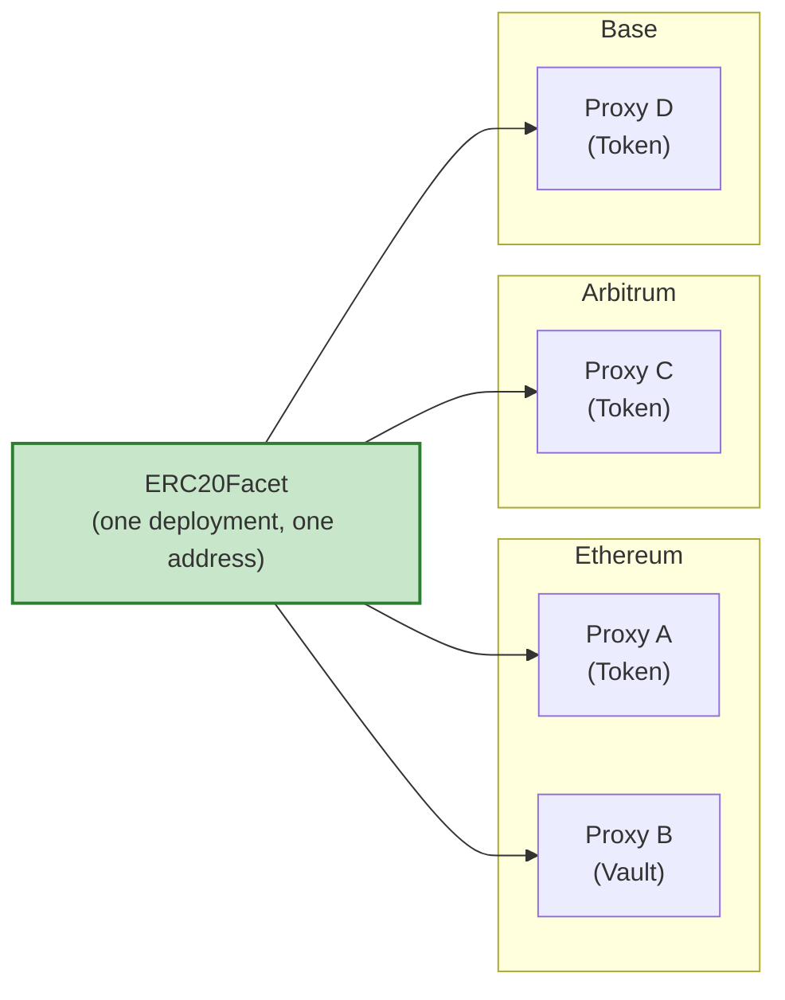

# Crane

Diamond-first Solidity framework for modular, upgradeable contracts using the ERC2535 Diamond pattern.

## Scope

Crane provides:

- Standardized Facet-Target-Repo architecture.
- Deterministic deployment infrastructure (CREATE3 and Diamond packages).
- Reusable access control, introspection, and token implementations.
- Protocol integration services for common DeFi primitives.
- Consistent testing patterns.

## Core Benefit: Facet Reuse

Facets are deployed as independent contracts at deterministic addresses. A single facet implementation serves any number of Diamond proxies on any number of chains.

Deployment cost for logic and bytecode is incurred once. Subsequent proxies pay only for storage initialization and minimal proxy deployment.

Packages define the set of facets and the initialization steps required to produce a functioning proxy. The same package produces consistent instances at predictable addresses when given the same arguments.

## How to Use These Docs

Navigation is driven by [SUMMARY.md](SUMMARY.md) (GitBook TOC — each page listed once).

- [Getting Started](getting-started.md) — install, agent reuse, map of required topics
- Concepts: architecture and patterns ([Facet-Target-Repo](concepts/facet-target-repo.md), [Registries](concepts/registries.md), [DFPkg](concepts/dfpkg.md))
- Development: style, documentation, and testing conventions
- Deployment: [CREATE3](deployment/create3.md), packages, factory services
- Utilities: [overview](utilities/overview.md), [sets](utilities/sets.md), [ConstProdUtils](utilities/math-const-prod.md)
- Access Control and Tokens: ready-to-use building blocks
- Protocols: [DEX](protocols/dexes.md), [lending](protocols/lending.md)
- Reference: interfaces, agent skills, [codebase map](CODEBASE_MAP.md)

## Prerequisites

Experienced Solidity developers. Familiarity with:

- ERC2535 Diamonds.
- Proxy patterns and storage collisions.
- Foundry.

## License

AGPL-3.0-or-later.
