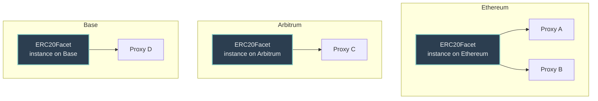

# Crane

Diamond-first Solidity framework for modular, upgradeable contracts using the ERC2535 Diamond pattern.

## Scope

Crane provides:

- Standardized Facet-Target-Repo architecture.
- Deterministic deployment infrastructure (CREATE3 and Diamond packages).
- Reusable access control, introspection, and token implementations.
- Protocol integration services for common DeFi primitives.
- Consistent testing patterns.

## Core Benefit: Facet Reuse

Facets are separate contracts. You **must deploy a facet instance on each chain** where you use it. CREATE3 can place those instances at the **same address** on every chain, but they are still distinct deployments (one per chain).

**Within one chain**, a single facet instance is shared by many Diamond proxies (deploy logic once, attach everywhere).

On a given chain, deployment cost for facet bytecode is paid once; later proxies mainly pay for storage init and minimal proxy deploy. Cross-chain, you pay to deploy the facet (and factories/packages) on each chain you support—CREATE3 keeps addresses predictable, not shared across chains.

Packages define the set of facets and the initialization steps required to produce a functioning proxy. The same package produces consistent instances at predictable addresses when given the same arguments.

## How to Use These Docs

Navigation is driven by [SUMMARY.md](SUMMARY.md) (GitBook TOC — each page listed once).

- [Getting Started](getting-started.md) — install, agent reuse, map of required topics
- Concepts: architecture and patterns ([Facet-Target-Repo](concepts/facet-target-repo.md), [Registries](concepts/registries.md), [DFPkg](concepts/dfpkg.md))
- Development: style, documentation, and testing conventions
- Deployment: [CREATE3](deployment/create3.md), packages, factory services
- Utilities: [overview](utilities/overview.md), [sets](utilities/sets.md), [ConstProdUtils](utilities/math-const-prod.md)
- Access Control and Tokens: ready-to-use building blocks
- Protocols: [DEX](protocols/dexes.md), [lending](protocols/lending.md)
- Reference: interfaces, agent skills, [codebase map](CODEBASE_MAP.md)

## Prerequisites

Experienced Solidity developers. Familiarity with:

- ERC2535 Diamonds.
- Proxy patterns and storage collisions.
- Foundry.

## License

AGPL-3.0-or-later.
