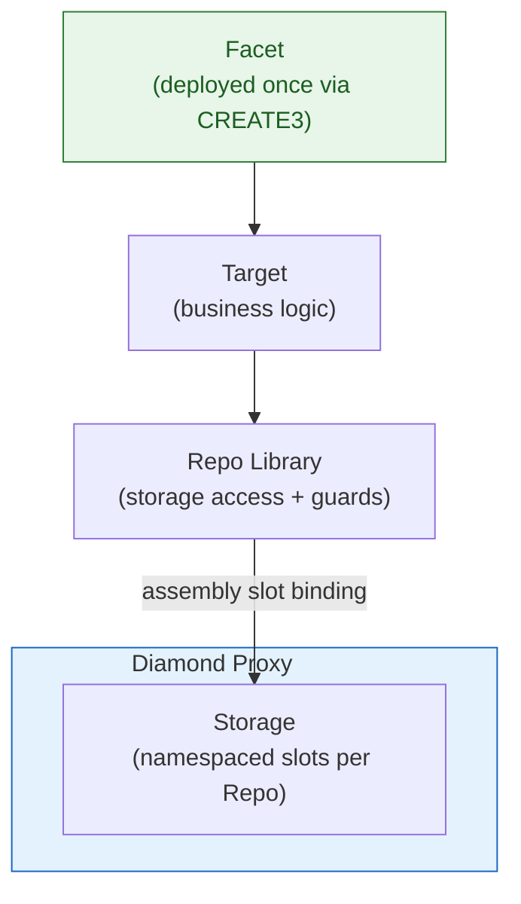

# Facet-Target-Repo

Every feature in Crane follows a three-layer architecture.

## Layers

| Layer  | File Suffix   | Responsibility                          | Deployed? |
|--------|---------------|-----------------------------------------|-----------|
| Repo   | `*Repo.sol`   | Storage layout and access functions     | No        |
| Target | `*Target.sol` | Business logic implementation           | No        |
| Facet  | `*Facet.sol`  | Diamond exposure and metadata           | Yes       |



The same `Facet` contract and address can be referenced by any number of proxies.

## Repo

A Repo is a library that owns a storage struct and provides all read/write operations on it.

- Storage slot is a `bytes32` constant derived from a hierarchical name.
- Dual `_layoutStruct()` functions: one that accepts an explicit slot, one that uses the constant.
- Every state-mutating or view function on the layout has two overloads: one that receives `Storage storage layoutStruct` as the first parameter, and one that calls the first using `_layoutStruct()`.

Example structure:

```solidity
library OperableRepo {
    bytes32 internal constant STORAGE_SLOT = keccak256(abi.encode("crane.access.operable"));

    struct Storage {
        mapping(address => bool) isOperator;
        // ...
    }

    function _layoutStruct() internal pure returns (Storage storage layoutStruct) {
        return _layoutStruct(STORAGE_SLOT);
    }

    function _layoutStruct(bytes32 slot) internal pure returns (Storage storage layoutStruct) {
        assembly { layoutStruct.slot := slot }
    }

    function _isOperator(Storage storage layoutStruct, address account) internal view returns (bool) {
        return layoutStruct.isOperator[account];
    }

    function _isOperator(address account) internal view returns (bool) {
        return _isOperator(_layoutStruct(), account);
    }
}
```

Repos contain guard functions (`_onlyOperator`, `_onlyOwner`, etc.). These hold the actual access control logic.

## Target

A Target is an abstract contract that inherits the required interfaces and implements the external functions by delegating to the corresponding Repo.

Targets contain the executable logic. They do not declare state variables.

## Facet

A Facet inherits from the Target and implements `IFacet`.

```solidity
contract OperableFacet is OperableTarget, IFacet {
    function facetName() external pure returns (string memory) {
        return type(OperableFacet).name;
    }

    function facetInterfaces() external view returns (bytes4[] memory) { ... }
    function facetFuncs() external view returns (bytes4[] memory) { ... }
    function facetMetadata() external view returns (string memory, bytes4[] memory, bytes4[] memory) { ... }
}
```

The facet is what gets cut into a Diamond. It exposes the function selectors that will be routed to the facet address.

## Reuse

The separation produces reusable facets:

- The facet contract contains only logic and a reference to immutable facet state (for packages). It has no proxy-specific storage.
- All persistent state lives in the proxy under slots controlled by Repos.
- The same facet bytecode and address can be attached to any number of proxies.
- Because slot derivation is deterministic and namespaced, different features do not collide even when many facets are installed on one proxy.

Facets are deployed through `Create3Factory.deployFacet`. The resulting address is the same on every chain for a given creation code and salt. Packages reference these addresses immutably. Every proxy created from the package executes against the shared facet implementations.

This amortizes deployment gas for logic across all instances and all chains.

## Modifiers

Access control modifiers live in thin `*Modifiers.sol` contracts:

```solidity
abstract contract OperableModifiers {
    modifier onlyOperator() {
        OperableRepo._onlyOperator();
        _;
    }
}
```

Modifiers delegate to the guard functions in the Repo. The logic remains in one place.

## Services

Complex orchestration that crosses multiple external contracts is placed in `*Service.sol` libraries. Services accept parameter structs to avoid stack-too-deep issues and remain stateless with respect to Diamond storage.

## When to Introduce Each Layer

- Add a Repo for any new persistent state.
- Add a Target when the logic must be unit-testable independently of a Diamond.
- Add a Facet when the functionality must be callable through a proxy.
- Add a DFPkg when the feature must be composed into new Diamonds via the factory.
- Add a Service when coordination with external routers, vaults, or other protocols is required.
- Add an AwareRepo when a proxy must hold a reference to an external singleton (router, factory, vault).
