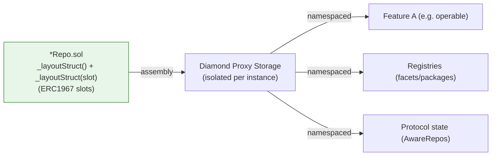

# Storage Slots

All persistent state in Crane lives in library-defined structs accessed via assembly slot binding. No contract or facet declares state variables. This design is core to the Facet-Target-Repo architecture: stateless, reusable facet implementations operate against per-proxy storage that is isolated by deterministic, namespaced slots.

Storage slots enable safe reuse of deployed facets and DFPkgs across many Diamond instances and chains. The same facet bytecode is attached to any number of proxies; each proxy's storage layout is governed exclusively by the Repos' slot constants.

## ERC1967-Compliant Slot Derivation (LR-6)

All `STORAGE_SLOT`, `DEFAULT_SLOT`, or equivalent constants in Repos **MUST** use the ERC1967 derivation:

```solidity
bytes32 internal constant DEFAULT_SLOT = bytes32(uint256(keccak256(abi.encode("your.hierarchical.slot.name"))) - 1);
```

**Canonical example** from `contracts/registries/facet/FacetRegistryRepo.sol`:

```solidity
// tag::DEFAULT_SLOT[]
bytes32 internal constant DEFAULT_SLOT = bytes32(uint256(keccak256(abi.encode("crane.registries.facets"))) - 1);
// end::DEFAULT_SLOT[]
```

**Other gold-standard compliant examples** (post LR-6 alignment):

- `OperableRepo`: `STORAGE_SLOT = bytes32(uint256(keccak256(abi.encode("crane.access.operable"))) - 1)`
- `ERC2535Repo`: `STORAGE_SLOT = bytes32(uint256(keccak256(abi.encode("eip.erc.2535"))) - 1)`

**Rationale** (from PRD LR-6): Matches the established EIP-1967 standard (https://eips.ethereum.org/EIPS/eip-1967). The `- 1` offset after the keccak provides a standard, collision-resistant, proxy-friendly slot. Using the direct `keccak256(...)` (without the cast and `- 1`) is non-compliant.

This applies to every Repo across the framework, including core access, introspection (ERC2535/ERC8109), registries, and protocol `*AwareRepo` libraries. The form ensures consistent layout computation across all EVM chains.

See also: [PRD.md](../../PRD.md) (LR-6 section) and the `crane-architecture` skill for slot rules.

## Ties to NatSpec Standard and Include Tags (LR-1)

Storage symbols are documented to the same standard as all public surface:

- Slot constants, `Storage` structs, and `_layoutStruct` overloads receive rich NatSpec (`@dev`, `@param`, `@return`).
- They are wrapped with exact AsciiDoc include tags for extraction:
  ```solidity
  // tag::STORAGE_SLOT[]
  bytes32 internal constant STORAGE_SLOT = bytes32(uint256(keccak256(abi.encode("eip.erc.2535"))) - 1);
  // end::STORAGE_SLOT[]
  ```
- Dual `_layoutStruct(bytes32)` and `_layoutStruct()` overloads are similarly tagged (e.g. `_layoutStruct(bytes32)[]`).

This follows the canonical ERC8023 gold standard and AGENTS.md rules. Documentation tooling can `include::` exact snippets. Custom NatSpec values for related selectors (e.g. IFacet methods `facetInterfaces()` = 0x2ea80826) are populated exclusively from `docs/reports/gap/CENTRALLY_COMPUTED_NATSPEC_VALUES.md` via the dedicated verification script (`scripts/foundry/ComputeNatSpecValues.s.sol`). See [development/natspec.md](../development/natspec.md).

Repos always document **both** the parameterized form (taking `Storage storage layoutStruct`) and the default overload.

## Slot Naming Convention

Use hierarchical dot-notation for collision-free namespacing:

- Core framework: `crane.*` (e.g. `crane.access.operable`, `crane.registries.facets`, `crane.registries.packages`)
- EIP implementations: `eip.erc.*` (e.g. `eip.erc.2535`, `eip.erc.8023`)
- Protocol integrations: `protocols.dexes.{protocol}.{version}.*` (e.g. `protocols.dexes.balancer.v3.vault.aware`)

The identical derivation rule is applied in every Repo.

## Dual Layout Access

Every Repo provides two `_layoutStruct` functions:

```solidity
// tag::_layoutStruct(bytes32)[]
function _layoutStruct(bytes32 slot_) internal pure returns (Storage storage layoutStruct_) {
    assembly { layoutStruct_.slot := slot_; }
}
// end::_layoutStruct(bytes32)[]

function _layoutStruct() internal pure returns (Storage storage layoutStruct) {
    return _layoutStruct(DEFAULT_SLOT);  // or STORAGE_SLOT
}
```

- Parameterless: uses the Repo's constant (most call sites).
- Parameterized: supports custom slots for testing, composition, or advanced multi-tenant scenarios.

Binding is 100% library-level (pure assembly). No state variables exist in Targets, Facets, or other contracts.

## Function Overloading Convention

Every storage operation is provided in dual form:

```solidity
function _canonicalFacet(Storage storage layoutStruct, bytes4 interfaceId) internal view returns (IFacet facet);
function _canonicalFacet(bytes4 interfaceId) internal view returns (IFacet facet) {
    return _canonicalFacet(_layoutStruct(), interfaceId);
}
```

Callers holding a `Storage` reference (e.g. inside other Repo functions or guards) pass it explicitly. External callers use the default overload. Guard functions (`_onlyXxx`) also follow this pattern.

## Why Libraries + Storage Isolation

Benefits:
- Layout defined once, used by all proxies that install the facet.
- Explicit, auditable assembly assignment.
- Zero risk of storage collisions between features or between independently authored code.
- Stateless facets + deterministic slots = "deploy once, attach everywhere" reuse.



The dual functions + ERC1967 slots guarantee isolation even when many facets (from multiple DFPkgs) are installed on one proxy.

## Slot Examples (Canonical + Common)

- `crane.registries.facets` (FacetRegistryRepo.DEFAULT_SLOT)
- `crane.registries.packages` (DiamondFactoryPackageRegistryRepo.DEFAULT_SLOT)
- `crane.access.operable` (OperableRepo.STORAGE_SLOT)
- `eip.erc.2535` (ERC2535Repo.STORAGE_SLOT — Diamond cut/loupe bookkeeping)
- `crane.access.erc8023` (MultiStepOwnableRepo)
- `protocols.dexes.balancer.v3.vault.aware` (protocol AwareRepo pattern)

## Cross-Links to Required GitBook Areas (LR-2)

Per PRD LR-2, storage slots are foundational to these required content areas:

- **Chain setup via CREATE3 Package**: Deploy your own Create3Factory using `Create3FactoryDFPkg` (and `ICREATE3DFPkg`). Resulting factories, registries, and all proxies use the ERC1967 slots defined here for consistent behavior on new chains. See [deployment/create3.md](../deployment/create3.md) (includes central NatSpec e.g. packageName 0xabc8b346, initAccount 0x870d4838) and [deployment/dfpkg.md](../deployment/dfpkg.md).
- **DiamondPackageCallBackFactory reuse**: The package factory (interfaceId `0x949da331` from CENTRALLY_COMPUTED_NATSPEC_VALUES.md) does **not** need redeployment per chain. It reuses the same facets/packages whose storage access is governed by these slots. Explicit reuse guidance lives in the deployment docs above + [CODEBASE_MAP.md](../CODEBASE_MAP.md).
- **Registries (Facet/Package/CallTarget)**: Purpose, auto-population (via Create3Factory + `_register*` calls during DFPkg init), and consumer interaction (`canonical*`, `facetsOf*`, queries) are all backed by Repos using ERC1967 slots. Full details: [CODEBASE_MAP.md](../CODEBASE_MAP.md).
- **Ported protocols + test usage**: All DEX/lending ports (CamelotV2, Uniswap, Aerodrome, BalancerV3, Aave, Euler) use `*AwareRepo`s or service state with protocol-prefixed slots. Test via `CraneTest` + `TestBase_*` inheritance (e.g. `TestBase_CamelotV2`, `TestBase_BalancerV3Vault`) + handlers/Behaviors. See protocol docs under `docs/protocols/`, [development/testing.md](../development/testing.md), and AGENTS.md testing section.
- **General utilities (Sets, ConstProdUtils, collections)**: `AddressSet`, `Bytes4Set`, etc. (and their `*SetRepo` helpers) are stored inside many Repo `Storage` structs (e.g. ERC2535Repo, FacetRegistryRepo). Math utilities like ConstProdUtils are used by protocol services alongside storage. Detailed coverage in [CODEBASE_MAP.md](../CODEBASE_MAP.md) under General Utilities.
- **Agent value proposition (LR-4)**: Reusing already-deployed verified facets/packages (via DFPkgs) eliminates agent-induced bugs in per-project redeploys and saves gas ("deploy once, attach everywhere", "agent-proof reuse"). Storage isolation via namespaced ERC1967 slots makes this safe and deterministic. See [getting-started.md](../getting-started.md), [building-with-crane.md](building-with-crane.md), and AGENTS.md.

Related:
- Architecture: [concepts/facet-target-repo.md](facet-target-repo.md) (Repos, dual layout, reuse), [building-with-crane.md](building-with-crane.md)
- NatSpec + verification: [development/natspec.md](../development/natspec.md) (use ONLY central values)
- Skills: `.claude/skills/crane-architecture` (Facet-Target-Repo + storage slots), `crane-deployment`
- Full source reference: `contracts/introspection/ERC2535/ERC2535Repo.sol`, `contracts/registries/facet/FacetRegistryRepo.sol`, `contracts/access/operable/OperableRepo.sol`

## Guidelines

- Always derive new slots with the ERC1967 `bytes32(uint256(keccak256(abi.encode(name))) - 1)` form.
- Give every feature its own namespace segment under the appropriate prefix.
- Protocol state uses the `protocols.*` prefix (even if implemented in a `*Service`).
- Never hardcode raw slot bytes outside the owning Repo's constant.
- When adding NatSpec to a Repo, wrap the slot/Storage/_layout symbols with exact `// tag::Name[]` markers (no extra spaces) and use the central NatSpec values document for any referenced selectors.
- Storage isolation and multi-instance safety must be validated in tests (LR-7).
