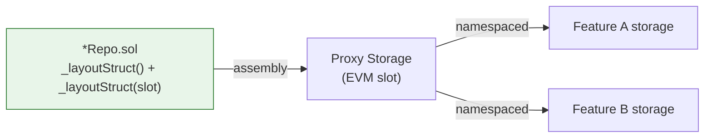

# Storage Slots

All persistent state in Crane lives in library-defined structs accessed via assembly slot binding. No contract declares state variables.

## Slot Derivation

```solidity
bytes32 internal constant STORAGE_SLOT = keccak256(abi.encode("crane.access.operable"));
```

Namespaces follow a dot-separated hierarchy:

- Core framework: `crane.*`
- EIP implementations: `eip.erc.*`
- Protocol integrations: `protocols.dexes.{protocol}.{version}.*`

The same derivation rule is used for every Repo. Collisions are prevented by the hierarchical naming.

## Dual Layout Access

Every Repo exposes two `_layout` functions:

```solidity
function _layoutStruct() internal pure returns (Storage storage);
function _layoutStruct(bytes32 slot) internal pure returns (Storage storage layoutStruct);
```

The parameterless version uses the constant. The parameterized version supports advanced composition or testing with alternate slots.

The binding happens purely at the library level — no state variables are declared in contracts or targets.

## Function Overloading Convention

For every operation there are two internal functions:

```solidity
function _getValue(Storage storage layoutStruct, address key) internal view returns (uint256);
function _getValue(address key) internal view returns (uint256) {
    return _getValue(_layoutStruct(), key);
}
```

Callers that already hold a layout reference use the first form. Most call sites use the second form.

## Why Libraries

- Storage layout is defined once and imported everywhere.
- The same layout definition serves every proxy that installs the corresponding facet.
- Assembly slot assignment is explicit and auditable.
- No storage layout conflicts between independently developed features.



The dual `_layoutStruct` functions allow both convenient default access and explicit slot use for composition or testing.

## Slot Examples

- `crane.access.operable`
- `crane.access.erc8023`
- `eip.erc.20`
- `protocols.dexes.balancer.v3.vault.aware`

## Guidelines

- Never hardcode magic slot values outside the constant in the owning Repo.
- New features receive their own namespace segment.
- Protocol-specific state uses the `protocols.*` prefix even when the logic lives in a service.
