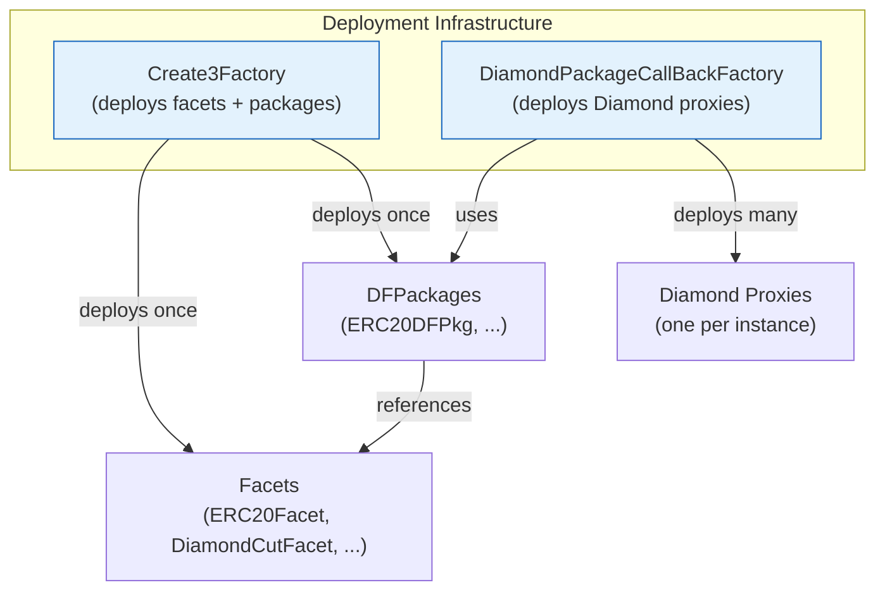

# CREATE3 Factory

`Create3Factory` provides deterministic deployment of arbitrary contracts using CREATE3 semantics. It is the foundation for facet and package reuse.



**Critical reuse note (LR-2):** The `DiamondPackageCallBackFactory` (the DPCF, implementing `IDiamondPackageCallBackFactory`) is deployed **once** per ecosystem/setup. It does **not** need to be redeployed per chain or per consumer. It is safe and intended for public reuse across all deployments and chains. 

Consumers obtain its address from a Create3Factory (via `diamondPackageFactory()` selector `0x0fe96d13`). 

```solidity
/// @custom:signature diamondPackageFactory()
/// @custom:selector 0x0fe96d13
function diamondPackageFactory() external view returns (IDiamondPackageCallBackFactory factory);
```

Deploying your own Create3Factory (via its DFPkg) is how you bootstrap a new chain presence; the callback factory is shared (interface ID `0x949da331` from central values).

```solidity
/// @custom:interfaceid 0x949da331
interface IDiamondPackageCallBackFactory { /* ... */ }
```

From implementation:
> @dev Deployed once via Create3Factory (see Create3Factory.diamondPackageFactory()). Safe and intended for reuse by any consumer on any chain.
> 
> This factory is intended to be deployed *once* per ecosystem and reused across chains/consumers.

See also `docs/deployment/dfpkg.md`. This directly enables amortized deployment costs and security-through-reuse (verified code reused via facets; no need to re-deploy logic).

### Guarantees


## Guarantees

- Address depends only on deployer, salt, and creation code (for packages with constructor arguments, the init data is included in the package deployment).
- Same inputs produce the identical address on every EVM chain.
- Facets and packages are deployed once and referenced by address thereafter.

## Setting Up a Chain Presence: CREATE3 Package (Create3FactoryDFPkg)

**LR-2 requirement:** Use the `Create3FactoryDFPkg` (implements `ICREATE3DFPkg` extending `IDiamondFactoryPackage`) to deploy your own `Create3Factory` Diamond for a new chain or isolated environment.

`PkgInit` and `PkgArgs` **must** be defined on the interface (see `ICREATE3DFPkg`):

```solidity
// tag::PkgInit-create3[]
interface ICREATE3DFPkg is IDiamondFactoryPackage {
    struct PkgInit {
        IFacet diamondCutFacet;
        IFacet multiStepOwnableFacet;
        IFacet operableFacet;
        IFacet create3FactoryFacet;
        IFacet facetRegistryFacet;
        IFacet packageRegistryFacet;
        IFacet callTargetRegistryQueryFacet;
        IFacet callTargetRegistryManagementFacet;
        IDiamondPackageCallBackFactory diamondFactory;  // the reusable one (see above)
    }

    struct PkgArgs {
        address owner;
    }
    // ...
}
// end::PkgInit-create3[]
```

Key central NatSpec values (use ONLY these; from `CENTRALLY_COMPUTED_NATSPEC_VALUES.md`):

- `packageName()` : `0xabc8b346`
- `facetInterfaces()` : `0x2ea80826`
- `facetAddresses()` : `0x52ef6b2c`
- `facetCuts()` : `0xa4b3ad35`
- `diamondConfig()` : `0x65d375b3`
- `calcSalt(bytes)` : `0xd82be56e`
- `initAccount(bytes)` : `0x870d4838`
- `postDeploy(address)` : `0x70068fcf`
- `deployCreate3Factory(address)` : `0x34cb11b5`

### Bootstrap Flow for New Chain

1. Obtain/deploy an initial `Create3Factory` entrypoint (bare `new Create3Factory{salt}(owner)` as in `InitDevService.initFactory`).
2. Use bootstrap to deploy canonical core facets (Cut, Ownable, Operable, Create3 facet, registry facets, etc.).
3. Wire the reusable `DiamondPackageCallBackFactory` (see reuse note; selector `0x1cdca5df` for set).
4. Deploy (or obtain) the `Create3FactoryDFPkg` passing the facets + the shared `diamondFactory` in `PkgInit`.
5. Call `deployCreate3Factory(owner)` on the DFPkg (internally delegates to `diamondFactory.deploy` using `PkgArgs`):

```solidity
// Example (selectors from central values)
ICREATE3DFPkg.PkgInit memory pkgInit = ICREATE3DFPkg.PkgInit({
    diamondCutFacet: IFacetRegistry(...).canonicalFacet(type(IDiamondCut).interfaceId),
    multiStepOwnableFacet: ...,
    operableFacet: ...,
    create3FactoryFacet: ...,
    facetRegistryFacet: ...,
    packageRegistryFacet: ...,
    callTargetRegistryQueryFacet: ...,
    callTargetRegistryManagementFacet: ...,
    diamondFactory: diamondFactory  // reusable, obtained via create3Factory.diamondPackageFactory() (0x0fe96d13)
});

Create3FactoryDFPkg pkg = Create3FactoryDFPkg( /* deployed via create3 or new for bootstrap */ );

// Deploy your chain's Create3Factory Diamond (deterministic via callback factory)
ICreate3FactoryProxy myFactory = pkg.deployCreate3Factory(owner);
// Internally uses: DIAMOND_FACTORY.deploy(SELF, abi.encode(PkgArgs({owner: owner})))
// (deploy selector 0xe97fac05 on IDiamondPackageCallBackFactory)
```

See full implementation in `contracts/factories/create3/Create3FactoryDFPkg.sol` (includes `facetCuts()`, `initAccount` which calls `MultiStepOwnableRepo._initialize`, `packageMetadata()` etc.). `calcSalt` hashes the `pkgArgs`.

After, use `myFactory` for further deploys; registries are available on it.

This is how `InitDevService` and `InitBcService` stand up environments. See `CraneTest` for test usage.

Cross-reference: `docs/deployment/dfpkg.md` (general DFPkg + reuse), `contracts/InitDevService.sol`, `AGENTS.md` (Diamond Package Deployment Pattern).

## Registries Explanation

The `Create3Factory` system (and DFPkgs) automatically populates three registries on every deploy. Registries live as facets on the `Create3Factory` Diamond.

### Facet Registry (`IFacetRegistry`)
Purpose: Track deployed facets by name, interface, and function selectors. Enables lookup of canonical implementations instead of hardcoding addresses in every `PkgInit`.

Key methods (central selectors on related surfaces use `0x2ea80826` for `facetInterfaces` patterns):
- `canonicalFacet(bytes4 interfaceId) returns (IFacet)`
- `facetsOfInterface(bytes4)`
- `allFacets()`, `registerFacet(...)`, `setCanonicalFacet(...)`
- `deployFacet(...)` / `deployCanonicalFacet*` (these auto-register)

Population: `Create3Factory._registerFacet` calls `FacetRegistryRepo` using `facet.facetMetadata()` (from `IFacet` with `facetName() 0x5b6f4d01`, `facetInterfaces() 0x2ea80826`, `facetFuncs() 0x574a4cff`).

Consumers: Packages and `FactoryService`s resolve e.g. `IFacetRegistry(address(factory)).canonicalFacet(type(IDiamondCut).interfaceId)`.

### Diamond Factory Package Registry (`IDiamondFactoryPackageRegistry`)
Purpose: Track DFPkgs (by name, interfaces, constituent facets) for discovery and canonical resolution.

Key methods:
- `canonicalPackage(bytes4 interfaceId)`
- `deploy*Package*` variants (auto-register via `packageMetadata()`)
- `registerPackage(...)`, `setCanonicalPackage(...)`

Population: Automatic in `Create3Factory._registerPackage` after `deployPackage*`.

### Call Target Registry (Query + Management)
Purpose: Controls default and per-caller allowed external call targets (used by metatx/relayer patterns and `ICallTargetRegistry*`).

Populated/used via the facets installed by `Create3FactoryDFPkg` (and `CallTargetRegistryDFPkg`).

See `contracts/registries/facet/IFacetRegistry.sol`, `contracts/registries/package/IDiamondFactoryPackageRegistry.sol`, and `ICallTargetRegistry*` interfaces. Query from any `Create3Factory` instance.

Consumers interact via the registry facets exposed on `Create3Factory` (no separate deployment needed once bootstrapped).

## Using Factories in Protocol Tests and Utilities (Cross-Links)

Protocol integrations and tests rely on the factories + `CraneTest`.

**Inheritance pattern (see `contracts/test/CraneTest.sol`):**

```solidity
import {CraneTest} from "@crane/contracts/test/CraneTest.sol";

abstract contract TestBase_MyProtocol is CraneTest {  // or other TestBase_*
    function setUp() public virtual override {
        CraneTest.setUp();  // calls InitDevService.initEnv -> wires create3Factory + diamondPackageFactory + registries
        // ...
    }
}
```

`InitDevService.initEnv(address(this))` deploys canonicals under deterministic salts and wires `diamondPackageFactory`.

**Example protocol test bases (cross-links):**
- Camelot V2: `contracts/protocols/dexes/camelot/v2/test/bases/TestBase_CamelotV2.sol` (inherits Weth9 + setup)
- Balancer V3 Vault: `contracts/protocols/dexes/balancer/v3/test/bases/TestBase_BalancerV3Vault.sol` (inherits CraneTest + VaultContractsDeployer)
- Reliquary: `contracts/protocols/staking/reliquary/v1/test/bases/TestBase_Reliquary.sol`
- See `test/foundry/spec/protocols/dexes/balancer/v3/pool-constProd/BalancerV3ConstantProductPoolDFPkg_Integration.t.sol` for `create3Factory.deployFacet` + `diamondFactory.deploy(pkg, pkgArgs)` usage + registry checks.

In tests, after `setUp`:
```solidity
// Deploy via Create3
IFacet myFacet = create3Factory.deployFacet(
    type(MyFacet).creationCode,
    abi.encode(type(MyFacet).name)._hash()
);

// Deploy proxy via reusable DPCF
address proxy = diamondFactory.deploy(pkg, abi.encode(pkgArgs));  // selector 0xe97fac05
```

**Protocol utilities used in these tests:**
- Constant product math: `ConstProdUtils` (see `contracts/utils/math/ConstProdUtils.sol` and tests under `test/foundry/spec/utils/math/constProdUtils/`)
- DEX-specific services: `CamelotV2Service`, Balancer router helpers, etc. (in `contracts/protocols/dexes/*/services/`)
- Stubs for mocks: in protocol `stubs/` and test bases.
- General type libs (used across): `AddressSetRepo`, `Bytes32SetRepo` etc. (see `contracts/utils/collections/` and Repos).

See `crane-testing` patterns, `AGENTS.md` TestBase/Behavior sections, and `docs/protocols/*` for integration details. Tests assert determinism, registry population, and use `Behavior_*` libs for interface compliance (e.g. `Behavior_IFacet`).

This cross-linking ensures protocol ports reuse the CREATE3 chain bootstrap and shared DPCF without duplication.

## Core Methods

### deploy

Deploys any contract (see `ICreate3Factory.create3`).

```solidity
/// @custom:signature create3(bytes,bytes32)
/// @custom:selector 0xa7b62a7f
address deployed = create3Factory.create3(creationCode, salt);
```

### deployFacet

Convenience for facets (no constructor arguments).

```solidity
IFacet facet = create3Factory.deployFacet(
    type(MyFacet).creationCode,
    abi.encode(type(MyFacet).name)._hash()
);
```

### deployPackageWithArgs

Deploys a package that requires constructor arguments (typically immutable facet references).

```solidity
/// @custom:signature create3WithArgs(bytes,bytes,bytes32)
/// @custom:selector 0x1f7fe4db
address pkg = create3Factory.deployPackageWithArgs(
    type(MyDFPkg).creationCode,
    abi.encode(IMyDFPkg.PkgInit({ facet: facetAddress })),
    salt
);
```

Also see `diamondFactory.deploy(pkg, pkgArgs)` (selector `0xe97fac05`) and `calcAddress` (`0x33a41d70`) on the reusable callback factory.

## Salt Convention

Salts are produced from the contract type name:

```solidity
using BetterEfficientHashLib for bytes;

bytes32 salt = abi.encode(type(MyContract).name)._hash();
```

This convention produces stable, human-readable salts and prevents accidental collisions between unrelated contracts.

## Canonical Deployment in Tests and Scripts

`InitDevService.initEnv` deploys the full set of core facets and both factories under deterministic salts. It also wires registries so that canonical facets for common interfaces can be retrieved by interface ID.

All core facets (DiamondCut, MultiStepOwnable, Operable, ERC165, Loupe, etc.) are deployed exactly once per environment and reused by every package and proxy created in that environment.

## Registry Integration

See the detailed "Registries Explanation" section above for purpose, population mechanics (via `_register*` in Create3Factory), and consumer usage (`canonicalFacet` etc. via interface ID). The factory system maintains facet and package registries. Packages and higher-level services can resolve the canonical facet for a given interface instead of passing addresses explicitly in every `PkgInit`. Registries are exposed as facets on bootstrapped Create3Factory instances (installed via Create3FactoryDFPkg).

## See also

- [Registries (concept)](../concepts/registries.md)
- [DFPkg Pattern](../concepts/dfpkg.md)
- [Diamond Factory Packages](dfpkg.md)
- [Factory Services](factory-services.md)
- [Getting Started](../getting-started.md)
- [Testing Patterns](../development/testing.md)
