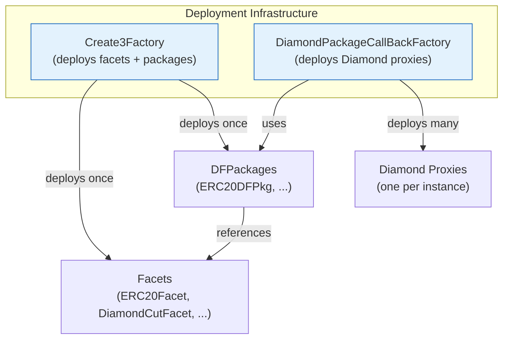

# CREATE3 Factory

`Create3Factory` provides deterministic deployment of arbitrary contracts using CREATE3 semantics. It is the foundation for facet and package reuse.



### Guarantees


## Guarantees

- Address depends only on deployer, salt, and creation code (for packages with constructor arguments, the init data is included in the package deployment).
- Same inputs produce the identical address on every EVM chain.
- Facets and packages are deployed once and referenced by address thereafter.

## Core Methods

### deploy

Deploys any contract.

```solidity
address deployed = create3Factory.deploy(creationCode, salt);
```

### deployFacet

Convenience for facets (no constructor arguments).

```solidity
IFacet facet = create3Factory.deployFacet(
    type(MyFacet).creationCode,
    abi.encode(type(MyFacet).name)._hash()
);
```

### deployPackageWithArgs

Deploys a package that requires constructor arguments (typically immutable facet references).

```solidity
address pkg = create3Factory.deployPackageWithArgs(
    type(MyDFPkg).creationCode,
    abi.encode(IMyDFPkg.PkgInit({ facet: facetAddress })),
    salt
);
```

## Salt Convention

Salts are produced from the contract type name:

```solidity
using BetterEfficientHashLib for bytes;

bytes32 salt = abi.encode(type(MyContract).name)._hash();
```

This convention produces stable, human-readable salts and prevents accidental collisions between unrelated contracts.

## Canonical Deployment in Tests and Scripts

`InitDevService.initEnv` deploys the full set of core facets and both factories under deterministic salts. It also wires registries so that canonical facets for common interfaces can be retrieved by interface ID.

All core facets (DiamondCut, MultiStepOwnable, Operable, ERC165, Loupe, etc.) are deployed exactly once per environment and reused by every package and proxy created in that environment.

## Registry Integration

The factory system maintains facet and package registries. Packages and higher-level services can resolve the canonical facet for a given interface instead of passing addresses explicitly in every PkgInit.
