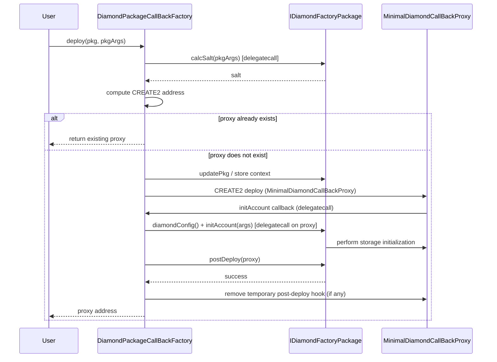

# Diamond Factory Packages (DFPkg)

A DFPkg is a contract that implements `IDiamondFactoryPackage`. It packages a set of facet references and the logic required to initialize a new Diamond proxy.

## Value

- Facets are deployed separately and referenced by address.
- A package declares exactly which facets and which functions are installed.
- Initialization (`initAccount`) and post-deployment hooks are executed inside the deployment transaction via delegatecall.
- The same package + arguments always produce a proxy at the same address.

Because facets are immutable references inside the package, every proxy created from the package shares the identical logic implementations.

The `DiamondPackageCallBackFactory` that executes DFPkg deployments (via `pkg.deploy(diamondFactory, args)`) is deployed once and reused across chains and projects. You obtain it from your Create3Factory; you do not deploy a new callback factory for each chain or DFPkg use.

## Interface

```solidity
interface IDiamondFactoryPackage {
    struct DiamondConfig {
        IDiamond.FacetCut[] facetCuts;
        bytes4[] interfaces;
    }

    function packageName() external view returns (string memory);
    function facetCuts() external view returns (IDiamond.FacetCut[] memory);
    function diamondConfig() external view returns (DiamondConfig memory);
    function calcSalt(bytes memory pkgArgs) external view returns (bytes32);
    function initAccount(bytes memory initArgs) external;
    function postDeploy(address account) external returns (bool);
    // ...
}
```

## Typical Package Structure

**Important**: `PkgInit` and `PkgArgs` **must** be defined inside the `I*DFPkg` interface (not the contract implementation). This allows type-safe references like `IMyDFPkg.PkgInit` from FactoryServices and callers.

See the `crane-architecture` skill `references/dfpkg-pattern.md` for the full rule and the frequent error of defining them on the contract.

```solidity
interface IERC20DFPkg {
    struct PkgInit {
        IFacet erc20Facet;   // constructor argument
    }
    struct PkgArgs {
        string name;
        string symbol;
        uint8 decimals;
        uint256 totalSupply;
        address recipient;
    }
}

contract ERC20DFPkg is IERC20DFPkg, IDiamondFactoryPackage {
    IFacet immutable ERC20_FACET;

    constructor(PkgInit memory pkgInit) {
        ERC20_FACET = pkgInit.erc20Facet;
    }

    function facetCuts() public view returns (IDiamond.FacetCut[] memory cuts) {
        cuts = new IDiamond.FacetCut[](1);
        cuts[0] = IDiamond.FacetCut({
            facetAddress: address(ERC20_FACET),
            action: IDiamond.FacetCutAction.Add,
            functionSelectors: ERC20_FACET.facetFuncs()
        });
    }

    function initAccount(bytes memory initArgs) external {
        // decode pkgArgs and call ERC20Repo._initialize etc.
    }

    function calcSalt(bytes memory pkgArgs) public pure returns (bytes32) {
        // usually keccak256(abi.encode(pkgArgs)) or similar
    }
}
```

## Deployment Flow (via DiamondPackageCallBackFactory)



The detailed original sequence is also present as NatSpec in `contracts/factories/diamondPkg/IDiamondFactoryPackage.sol`.

### Numbered Steps

1. Caller invokes `factory.deploy(pkg, pkgArgs)`.
2. Factory calls `pkg.calcSalt(pkgArgs)` to obtain the CREATE2 salt for the proxy.
3. If a proxy already exists at the computed address, it is returned immediately.
4. Otherwise the factory deploys a `MinimalDiamondCallBackProxy` via CREATE2.
5. The proxy calls back into the factory.
6. The factory stores the package and arguments, then delegatecalls `pkg.initAccount(processedArgs)` on the proxy.
7. The package performs all storage initialization (setting owners, writing token metadata, etc.).
8. The factory calls `pkg.postDeploy(proxy)`.
9. Optional post-deploy hook facet is removed.
10. The proxy address is returned.

The package never holds proxy state. It only supplies cuts and performs initialization.

## Reuse Characteristics

- One `ERC20Facet` deployment serves every ERC20 proxy created from `ERC20DFPkg` on that chain.
- The facet address is identical on every chain when deployed with the same salt.
- Adding a new feature requires only a new facet deployment and a new or updated package. Existing proxies are unaffected unless upgraded.
- Cross-chain deployment scripts can compute addresses in advance and verify that the expected facets and packages already exist at those addresses.

## Helper Methods on Packages

Many packages expose convenience `deploy(...)` functions that encode arguments and forward to the factory:

```solidity
IERC20 token = erc20Pkg.deploy(
    diamondFactory,
    "Example",
    "EX",
    18,
    1_000_000e18,
    recipient,
    bytes32(0)
);
```

## Post-Deploy Hooks

Packages may install a temporary `PostDeployAccountHookFacet` during initialization. After `postDeploy` returns, the factory removes the hook facet. This provides a safe window for privileged one-time setup actions.

## Application / Consumer Layers

Crane's DFPkg + factory primitives are general. Some projects add registry or manager facades on top for registration, discovery, and access control of certain package types. Those additional rules and entry points are the responsibility of the consuming application — see the consumer's documentation.
