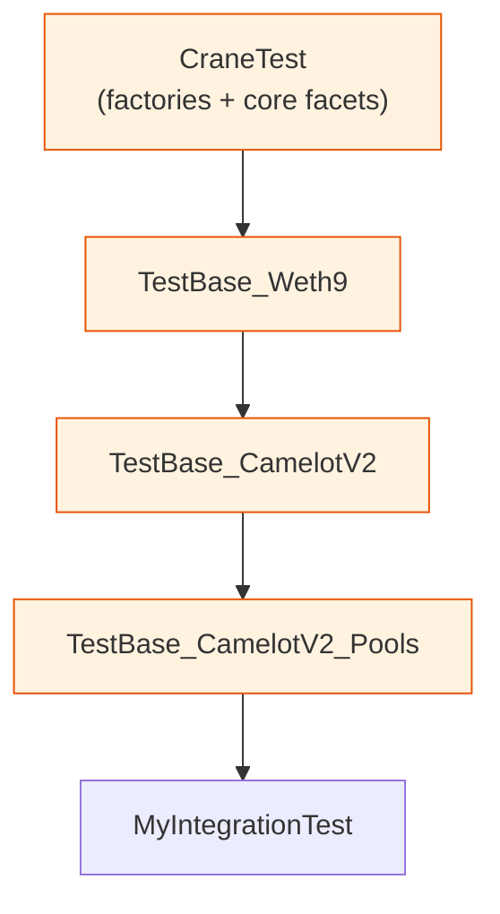

# Testing Patterns

Crane tests separate infrastructure setup, behavior specification, and invariant declarations.

## Directory Layout

- Test infrastructure (`TestBase_*`, `Behavior_*`, stubs, comparators) lives next to the contracts under `contracts/`.
- Concrete test specifications live under `test/foundry/spec/` mirroring the `contracts/` tree.

## TestBase Types

### Setup TestBases

Inherit to obtain pre-deployed protocol actors and factories.

Example chain:



Each level calls `super.setUp()` and deploys only if the dependency is not already present.

### Behavior TestBases

Define the expected shape of an interface via virtual functions. Concrete tests supply the instance under test.

```solidity
abstract contract TestBase_IFacet is Test {
    function facetTestInstance() public virtual returns (IFacet);
    function controlFacetInterfaces() public view virtual returns (bytes4[] memory);
    // ...
}
```

## Behavior Libraries

`Behavior_IInterface` libraries contain:

- `expect_*` — record expected values in comparator storage.
- `isValid_*` / `areValid_*` — direct comparison of actual vs expected.
- `hasValid_*` — validation against previously recorded expectations.

Behavior libraries produce structured logs on mismatch and are used by both unit tests and invariant handlers.

## Invariant / Fuzz Testing

Use a Handler contract that:

- Normalizes fuzzed seeds to a small set of addresses.
- Tracks expected state alongside the system under test.
- Declares `vm.expectRevert` and `vm.expectEmit` before every state-changing call.

The test contract registers the handler and declares `invariant_*` functions. These functions are discovered and executed by Foundry between handler calls.

## Comparator Infrastructure

Set comparators (`AddressSetComparator`, `Bytes4SetComparator`, etc.) store expected collections keyed by `(subject, selector)`. They provide detailed diff output when assertions fail.

## Recommended Flow

1. Write or extend a `TestBase_*` that provides the SUT.
2. For interface compliance, inherit the corresponding `TestBase_I*` and implement the control functions.
3. For stateful properties, implement a Handler + register invariants.
4. Use Behavior libraries for reusable validation logic instead of duplicating assertions.
