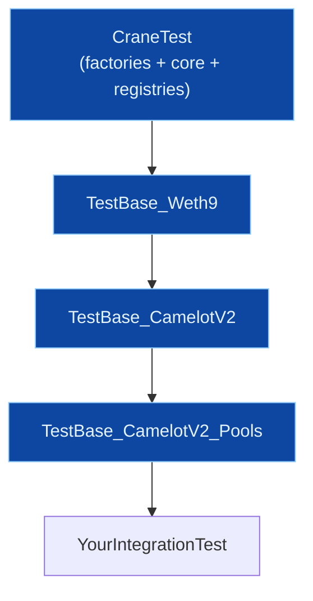

# Testing Patterns

Crane tests separate infrastructure setup, behavior specification, and invariant declarations. All patterns strictly follow **LR-7 Testing Standards** (full/correct initialization before any asserts, exact expected-value assertions and state deltas, mandatory `Behavior_*` libraries for declarations, preview/execute parity, CREATE3/salt determinism + registry population verification, NatSpec + include-tags on test code that exposes APIs, handler-driven invariants, and fork parity for ports).

**Production-first:** Prefer real production contracts and production deploy paths (`CraneTest` factories, full DFPkg init). Do **not** invent mocks for the subject under test. See the ladder and terminology in `AGENTS.md` (Testing) and the `crane-testing` skill.

**LR-2 GitBook Focus (this document):** Detailed patterns, Behavior libs, handlers, TestBase usage, cross-links to registries, ported protocols, and utilities (Sets, ConstProdUtils, etc.). Content enables agents and developers to correctly exercise Crane for safe reuse of verified facets/packages (see LR-4).

**Central NatSpec Rule (aligns LR-1/LR-7):** Any NatSpec examples or declaration tests shown here use **ONLY** values from the central NatSpec values file at `docs/archive/reports/gap/CENTRALLY_COMPUTED_NATSPEC_VALUES.md` (archived after GitBook hygiene; still the in-repo single source for selectors). Never ad-hoc `cast` in docs. See [NatSpec and Documentation](natspec.md) and the dedicated `scripts/foundry/ComputeNatSpecValues.s.sol` verification script.

See also: repo-root `AGENTS.md` (crane-testing section + full TestBase/Behavior/handler examples), `PRD.md` (LR-2/LR-7), `crane-testing` skill.

## Directory Layout

Test infrastructure lives **in `contracts/`** next to production code (ensures behaviors and bases stay in sync with implementation). Concrete specifications (unit, integration, invariant, fork) live under `test/foundry/spec/` mirroring the tree.

```
contracts/
├── test/
│   ├── CraneTest.sol                 # Factory bootstrap (create3 + diamondPackageFactory) + registries
│   ├── IHandler.sol
│   ├── behaviors/BehaviorUtils.sol
│   ├── comparators/                  # Bytes4SetComparator, AddressSetComparator, StringComparator, ...
│   ├── stubs/                        # Minimal implementations (greeter, ERC20TargetStub, ...)
│   └── ...
├── factories/diamondPkg/
│   ├── TestBase_IFacet.sol
│   └── Behavior_IFacet.sol
├── introspection/ERC165/
│   ├── TestBase_IERC165.sol
│   └── Behavior_IERC165.sol
├── access/ERC8023/
│   └── TestBase_IMultiStepOwnable.sol  # Includes MultiStepOwnableHandler
├── tokens/ERC20/
│   ├── TestBase_ERC20.sol            # Includes ERC20TargetStubHandler + invariants
│   └── ...
├── protocols/dexes/camelot/v2/
│   └── test/bases/
│       └── TestBase_CamelotV2.sol
└── protocols/.../test/bases/         # All protocol TestBases here

test/foundry/spec/
├── factories/diamondPlg/             # IFacet_Behavior_Test.sol, DiamondPackageCallBackFactory.t.sol (LR-7 decl tests)
├── protocols/dexes/camelot/v2/
│   ├── handlers/CamelotV2Handler.sol
│   └── services/...
├── tokens/ERC20/ERC20TargetStub.t.sol
└── ... (mirrors contracts/)
```

**Key Conventions (from AGENTS.md):**
- `TestBase_*` and `Behavior_*` live in `contracts/`.
- Protocol bases go in `contracts/protocols/.../test/bases/`.
- Specs go in `test/foundry/spec/`.
- Stubs/comparators in `contracts/test/`.

See AGENTS.md "Directory Structure" and "Key Testing Files".

## CraneTest Bootstrap + Registries (Cross-link to Required GitBook Areas)

`CraneTest` (inheriting `BetterTest`) bootstraps the two-factory system via `InitDevService.initEnv`. Inherit it (or a protocol base that does) for deterministic deploys + access to registries.

```solidity
import {CraneTest} from "@crane/contracts/test/CraneTest.sol";

abstract contract MyTest is CraneTest {
    function setUp() public virtual override {
        CraneTest.setUp(); // if (diamondFactory == 0) { (create3Factory, diamondPackageFactory) = InitDevService... }
        // registries are now queryable on create3Factory
    }
}
```

**Registries (see `docs/deployment/create3.md` "Registries Explanation" and `docs/deployment/dfpkg.md`):**
The `Create3Factory` system + DFPkgs automatically populate:
- Facet Registry (`IFacetRegistry`)
- Package Registry (`IDiamondFactoryPackageRegistry`)
- CallTarget Registry

Consumers interact via the registry facets on the factory (no separate deploy). Per LR-7, after any factory/package deploy in tests, assert expected entries (see registry `Handler_*` and spec tests under `test/foundry/spec/registries/`).

**DiamondPackageCallBackFactory reuse (LR-2):** Interface ID `0x949da331`. It is safe and intended for public reuse across chains/projects — do not redeploy it yourself. See `docs/deployment/create3.md` and `IDiamondPackageCallBackFactory` (selectors e.g. `deploy` 0xe97fac05, `calcAddress` 0x33a41d70, `pkgOfAccount` 0x8a648684 from central values).

Cross-link: `contracts/factories/diamondPkg/DiamondPackageCallBackFactory.sol`, `InitDevService`, `docs/deployment/create3.md`.

Protocol tests commonly inherit `CraneTest` directly or via `TestBase_*` chains that call it.

## Protocol Setup TestBases

Build layered dependencies via inheritance. Each calls `super.setUp()` (or explicit parent) and deploys **only** if not preset (`address(x) == address(0)` guard).

Mermaid example (Camelot):



Camelot example (`contracts/protocols/dexes/camelot/v2/test/bases/TestBase_CamelotV2.sol`):
```solidity
abstract contract TestBase_CamelotV2 is TestBase_Weth9 {
    ICamelotFactory internal camelotV2Factory;
    ICamelotV2Router internal camelotV2Router;

    function setUp() public virtual override {
        camelotV2FeeToSetter = makeAddr("...");
        TestBase_Weth9.setUp();
        if (address(camelotV2Factory) == address(0)) {
            camelotV2Factory = new CamelotFactory(camelotV2FeeToSetter);
        }
        if (address(camelotV2Router) == address(0)) {
            camelotV2Router = new CamelotRouter(address(camelotV2Factory), address(weth));
        }
    }
}
```

**Cross-links for detailed protocol TestBase + usage (LR-2 required areas):**
- All DEXes: `docs/protocols/dexes.md` (Camelot V2 + `TestBase_CamelotV2` + `TestBase_CamelotV2_Pools` + `CamelotV2Handler`; Uniswap V2/V3/V4 + Aerodrome + Slipstream bases + fork variants; Balancer V3 `TestBase_BalancerV3Vault` + real `BalancerV3VaultDFPkg` + pool DFPkg bases).
- Lending: `docs/protocols/lending.md` (Aave `ProtocolV3TestBase` + Aave v4 `Base` + `AaveV4TestOrchestration` + `deployTestEnv`; Euler EVC/EVault test bases; combinable with CraneTest).
- **Protocol ports vs forks:** Protocol ports under `contracts/protocols/.../stubs/` are real/protocol-faithful implementations for fast hermetic deploy inside TestBases (not canned interface mocks). Fork bases (e.g. `TestBase_*Fork`) use `vm.createSelectFork` + network constants. Do not mix hermetic ports and fork addresses in one base without a clear mode switch.
- **Harness stubs vs mocks:** `contracts/test/stubs/` and mintable ERC20s add test controllability outside the SUT. Do not mock facets/DFPkgs/diamonds under test.
- DFPkg integration tests (Balancer example): use `diamondFactory.deploy(pkg, pkgArgs)` with real facets (never address(0) — LR-7 violation).

See also `contracts/protocols/.../test/bases/` and `test/foundry/spec/...` for concrete inheritance + usage.

## Behavior TestBases + Behavior Libraries (Mandatory for Standards per LR-7)

**Behavior TestBases** declare expected values via virtuals; concrete tests supply the SUT instance and run the assertions.

Core example (`contracts/factories/diamondPkg/TestBase_IFacet.sol`):
```solidity
abstract contract TestBase_IFacet is Test {
    IFacet internal testFacet;

    function setUp() public virtual { testFacet = facetTestInstance(); }

    function facetTestInstance() public virtual returns (IFacet);
    function controlFacetName() public view virtual returns (string memory);
    function controlFacetInterfaces() public view virtual returns (bytes4[] memory);
    function controlFacetFuncs() public view virtual returns (bytes4[] memory);

    function test_IFacet_facetName() public view { ... Behavior ... }
    function test_IFacet_FacetInterfaces() public { ... length + Behavior.areValid_ ... }
    function test_IFacet_FacetFunctions() public { ... }
    function test_IFacet_FacetMetadata_Consistency() public { ... }
    function test_IFacet_InterfaceId_Computation() public pure { ... }
}
```

**Behavior Libraries** (`Behavior_IInterface`) encapsulate validation + structured logging. Never duplicate assertions for IFacet / IDiamondFactoryPackage / protocol standards.

Patterns:
- `expect_*` — store expectations (e.g. `expect_IFacet_facetInterfaces(subject, expected)`)
- `areValid_*` / `isValid_*` — direct compare (returns bool, logs on mismatch)
- `hasValid_*` — validate against prior `expect_*` (used in declaration tests)

See full in `Behavior_IFacet`, `Behavior_IERC165`, `BehaviorUtils`.

**IFacet Declaration Tests (LR-7 mandatory):** Every Facet must declare correct `facetInterfaces()` / `facetFuncs()` / `facetName()` / `facetMetadata()`. Use `Behavior_IFacet` (or `TestBase_IFacet`).

Use **ONLY central values** from `CENTRALLY_COMPUTED_NATSPEC_VALUES.md`:
- `facetName()`: `0x5b6f4d01`
- `facetInterfaces()`: `0x2ea80826`
- `facetFuncs()`: `0x574a4cff`
- `facetMetadata()`: `0xf10d7a75`
- `supportsInterface(bytes4)`: `0x01ffc9a7`

Example in tests (see `test/foundry/spec/factories/diamondPlg/IFacet_Behavior_Test.sol` and Balancer `*Facet_IFacet.t.sol`):
```solidity
// controlFacetInterfaces / controlFacetFuncs return the expected arrays
assertTrue(Behavior_IFacet.areValid_IFacet_facetInterfaces(testFacet, control..., actual));
```

**Package Declaration Tests (LR-7):** `packageName()` (`0xabc8b346`), `facetCuts()` (`0xa4b3ad35`), `diamondConfig()` (`0x65d375b3`), `calcSalt(bytes)` (`0xd82be56e`), `initAccount(bytes)` (`0x870d4838`), `postDeploy(address)` (`0x70068fcf`), `facetInterfaces()` etc. Full lifecycle (including delegatecall `initAccount`) + salt determinism + real-facet DFPkg tests.

See `DiamondPackageCallBackFactory.t.sol` for LR-7 examples using Behavior + exact asserts.

## Handlers for Invariant / Fuzz Testing

Handlers expose fuzzer-callable ops, normalize inputs, declare expectations with `vm.expect*`, track ghost state for invariants.

**Actor/seed normalization** (small fixed address space):
```solidity
function addrFromSeed(uint256 seed) public pure returns (address) {
    return address(uint160((seed % 16) + 1));
}
```

**useActor modifier example** (MultiStepOwnableHandler):
```solidity
modifier useActor(uint256 actorIndexSeed) {
    currentActor = actors[BetterVM.bound(actorIndexSeed, 0, actors.length-1)];
    vm.startPrank(currentActor); _; vm.stopPrank();
}
```

**Explicit expectations** (ERC20TargetStubHandler transfer):
```solidity
vm.prank(owner);
if (amount > bal) {
    vm.expectRevert( abi.encodeWithSelector(IERC20Errors.ERC20InsufficientBalance.selector, ...) );
    sut.transfer(to, amount); return;
}
vm.expectEmit(true, true, false, true);
emit IERC20Events.Transfer(owner, to, amount);
sut.transfer(to, amount);
```

**Invariant registration** (in TestBase setUp):
```solidity
targetContract(address(handler));
targetSelector(FuzzSelector({addr: address(handler), selectors: [handler.transfer.selector, ...]}));
```

Then:
```solidity
function invariant_totalSupply_equals_sumBalances() public view { ... exact sum assert ... }
```

Examples:
- ERC20: `contracts/tokens/ERC20/TestBase_ERC20.sol` (handler tracks `_expectedAllowance`, seen addrs, asserts deltas inside handler + invariants in base)
- MultiStep: `contracts/access/ERC8023/TestBase_IMultiStepOwnable.sol` (ghostCurrentOwner, access matrix negative paths)
- Camelot K invariants: `test/foundry/spec/protocols/dexes/camelot/v2/handlers/CamelotV2Handler.sol` (kBefore/kAfter, proportional burn checks, op counters)

See AGENTS.md "Declarative Invariant Testing Pattern" and `contracts/test/IHandler.sol`.

Per LR-7: every state change uses `expectEmit` + exact post-state asserts (handler or invariant).

## Comparator Infrastructure

Comparators store expected collections keyed by `(subject address, selector)`. Provide rich error diffs + `console.logBehavior*`.

Used by Behavior libs (e.g. `Bytes4SetComparatorRepo._recExpectedBytes4`).

See `contracts/test/comparators/*.sol` and usage in `Behavior_IFacet`.

## Protocol + General Utilities in Tests (Cross-Links)

**Protocol-specific:**
- DEX services + `ConstProdUtils`: Camelot/Aerodrome/Uniswap V2 use `ConstProdUtils._saleQuote` / `_purchaseQuote` etc for parity checks against live router/pool execution inside TestBases. See `docs/protocols/dexes.md`, `contracts/utils/math/ConstProdUtils.sol`, dedicated constProdUtils spec tests, and CamelotV2Service.
- Lending utils: WadRayMath, SpokeUtils, LiquidationLogic (Aave); EVC Set/Transient/Lens/IRM (Euler).

**General utilities & type libs (LR-2 required coverage):**
- Sets: `AddressSet`, `Bytes32Set`, `Bytes4Set` (and `*Repo`) for actor tracking, expected interface lists, allowance keys in handlers/comparators. Dual `_layoutStruct(slot)` + default overload pattern.
- Other: `BetterEfficientHashLib`, `UInt256`, `BetterAddress`, rate provider adapters, Permit2Aware, etc.

Usage in tests: handlers/comparators use Sets/Repos for ghost state; dex TestBases use ConstProdUtils for expected quotes.

See `contracts/utils/collections/sets/`, `contracts/utils/math/`, protocol `services/`, `AGENTS.md`, and `docs/protocols/*`.

## Recommended Flow (for new tests / agent ports)

1. Inherit or extend appropriate `TestBase_*` (call parent `setUp()` first).
2. For interface compliance/declaration: implement control virtuals + inherit `TestBase_IFacet` (or call `Behavior_IFacet` directly). Assert length + `areValid_*`.
3. For stateful/invariants: implement Handler (normalize, `expect*`, track ghosts), register in setUp, write `invariant_*` exact asserts.
4. Use Behavior libs for standards; comparators for collections.
5. Full init (real facets), exact deltas, NatSpec on public test surface (with central values + `// tag::Name[]`).
6. Verify: `forge test --match-path ... -vvv`; assert registry entries + determinism for factories.

**LR-7 enforcement examples in Crane:**
- Balancer DFPkg real-facet integration tests (no 0 addresses).
- Camelot/Aerodrome quote parity (preview == execute deltas).
- IFacet declaration tests using Behavior + central selectors.
- Handler K invariants + burn proportionality.
- Registry population + salt determinism asserts post-deploy.

## NatSpec + Include-Tags on Test Artifacts (LR-1/LR-7)

Handlers, TestBases, Behavior helpers that expose public APIs must carry full NatSpec + exact `// tag::Symbol(params)[]` / `// end::` (hyphenated for overloads) + `@custom:selector`/`@custom:signature` using central values.

Gold standard examples live in `contracts/access/ERC8023/*` and updated factory tests.

See `docs/development/natspec.md`.

## Cross-Reference Summary (LR-2 GitBook Navigation)

- Registries, CREATE3 bootstrap, DFPkg reuse: [CREATE3](../deployment/create3.md), [DFPkg deploy](../deployment/dfpkg.md), [Registries](../concepts/registries.md), [DFPkg pattern](../concepts/dfpkg.md)
- Ported protocols + TestBase/handler details: [DEX Integrations](../protocols/dexes.md), [Lending](../protocols/lending.md)
- General utilities + Sets: [Utilities Overview](../utilities/overview.md), [Sets](../utilities/sets.md), [ConstProdUtils](../utilities/math-const-prod.md)
- Core patterns + full examples: `AGENTS.md` (Testing section)
- NatSpec process: [NatSpec](natspec.md)
- Getting started / agent reuse: [Getting Started](../getting-started.md)
- Source roots: `contracts/test/`, `contracts/*/TestBase_*.sol`, `contracts/*/Behavior_*.sol`, `test/foundry/spec/`
- Skills: `crane-testing`, protocol-specific skills

This surface makes Crane's validated components reusable with high confidence: initialize once via factories/TestBases, attach DFPkgs, rely on Behavior-validated declarations.

## Key Files (see AGENTS.md for complete list)

- `/contracts/test/CraneTest.sol`
- `/contracts/factories/diamondPkg/{TestBase_IFacet.sol,Behavior_IFacet.sol}`
- `/contracts/tokens/ERC20/TestBase_ERC20.sol`
- `/contracts/access/ERC8023/TestBase_IMultiStepOwnable.sol`
- `/contracts/protocols/dexes/camelot/v2/test/bases/TestBase_CamelotV2.sol`
- `test/foundry/spec/factories/diamondPlg/*_Behavior_Test.sol` (LR-7 exemplars)
- `contracts/utils/collections/sets/*SetRepo.sol` (and comparators)
- `contracts/utils/math/ConstProdUtils.sol`

Run: `forge test`, targeted with `--match-path`, or invariants automatically via `forge test`.

(End of detailed LR-2/LR-7 aligned testing patterns.)
